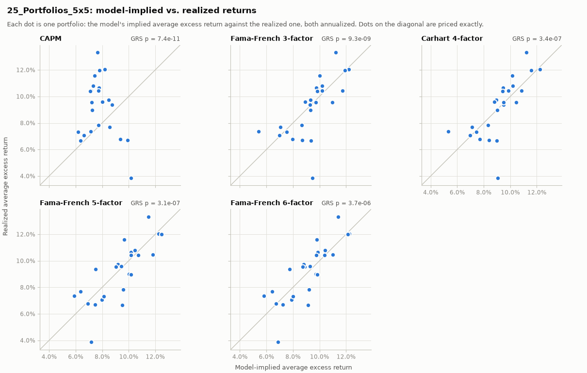
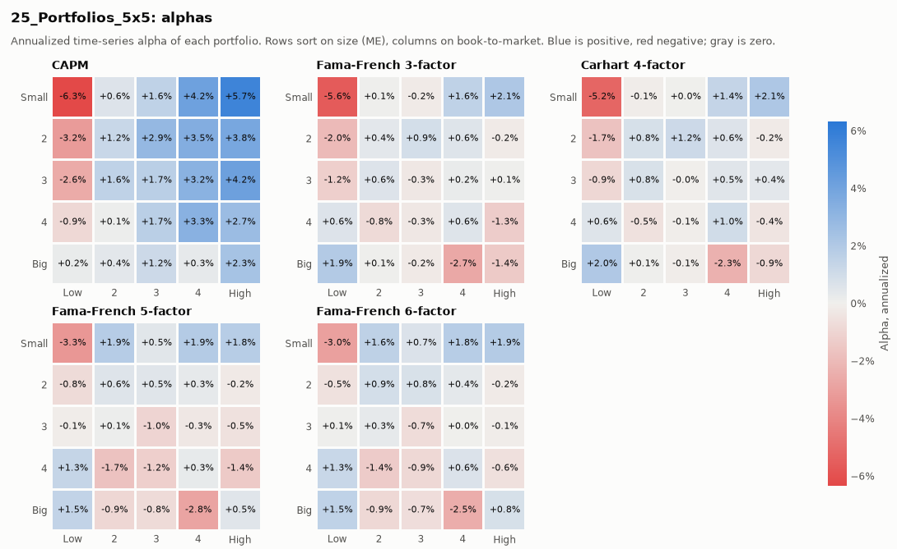

# Asset pricing tests: 25_Portfolios_5x5

25 value-weighted portfolios (25_Portfolios_5x5), monthly, Jul 1963 to Jul 2026 (757 periods). Returns are in excess of the T-bill rate; alphas and premia are annualized. Source: Kenneth R. French Data Library (saved snapshot `snapshot-2026-09-29`, downloaded 2026-09-29).

## GRS test: are all alphas jointly zero?

|  | GRS | p-value | A\|alpha\| (ann.) | A\|alpha\| / A\|r\| | SR(alpha) (ann.) | avg R2 | T | N |
|:---|---:|---:|---:|---:|---:|---:|---:|---:|
| CAPM | 4.20 | 7.4e-11 | 2.38% | 1.39 | 1.32 | 0.734 | 757 | 25 |
| Fama-French 3-factor | 3.63 | 9.3e-09 | 1.04% | 0.61 | 1.24 | 0.910 | 757 | 25 |
| Carhart 4-factor | 3.19 | 3.4e-07 | 0.96% | 0.56 | 1.19 | 0.910 | 757 | 25 |
| Fama-French 5-factor | 3.20 | 3.1e-07 | 1.05% | 0.61 | 1.19 | 0.916 | 757 | 25 |
| Fama-French 6-factor | 2.90 | 3.7e-06 | 0.97% | 0.56 | 1.15 | 0.917 | 757 | 25 |

Data: [grs.csv](grs.csv)

A|alpha| is the average absolute alpha; A|alpha| / A|r| compares it with the spread in average returns the model has to explain (Fama and French 2015). SR(alpha) is the maximum Sharpe ratio attainable from the alphas.

## Time-series alphas by portfolio

|  | CAPM alpha (ann.) | CAPM t(alpha) | Fama-French 3-factor alpha (ann.) | Fama-French 3-factor t(alpha) | Carhart 4-factor alpha (ann.) | Carhart 4-factor t(alpha) | Fama-French 5-factor alpha (ann.) | Fama-French 5-factor t(alpha) | Fama-French 6-factor alpha (ann.) | Fama-French 6-factor t(alpha) |
|:---|---:|---:|---:|---:|---:|---:|---:|---:|---:|---:|
| SMALL LoBM | -6.33% | -2.96 | -5.62% | -5.09 | -5.19% | -4.62 | -3.32% | -3.25 | -3.01% | -2.91 |
| ME1 BM2 | 0.61% | 0.32 | 0.08% | 0.09 | -0.11% | -0.13 | 1.85% | 2.32 | 1.62% | 2.00 |
| ME1 BM3 | 1.56% | 1.01 | -0.17% | -0.27 | 0.05% | 0.07 | 0.49% | 0.76 | 0.68% | 1.04 |
| ME1 BM4 | 4.15% | 2.64 | 1.56% | 2.68 | 1.42% | 2.39 | 1.91% | 3.24 | 1.78% | 2.99 |
| SMALL HiBM | 5.68% | 3.16 | 2.10% | 2.49 | 2.11% | 2.46 | 1.82% | 2.08 | 1.92% | 2.16 |
| ME2 BM1 | -3.20% | -1.97 | -2.02% | -2.59 | -1.71% | -2.15 | -0.76% | -1.07 | -0.54% | -0.75 |
| ME2 BM2 | 1.25% | 0.93 | 0.41% | 0.65 | 0.80% | 1.23 | 0.57% | 0.94 | 0.93% | 1.50 |
| ME2 BM3 | 2.88% | 2.32 | 0.89% | 1.33 | 1.18% | 1.73 | 0.50% | 0.78 | 0.78% | 1.21 |
| ME2 BM4 | 3.48% | 2.73 | 0.58% | 1.04 | 0.60% | 1.05 | 0.32% | 0.57 | 0.37% | 0.64 |
| ME2 BM5 | 3.84% | 2.43 | -0.16% | -0.27 | -0.17% | -0.28 | -0.20% | -0.33 | -0.19% | -0.30 |
| ME3 BM1 | -2.60% | -1.98 | -1.20% | -1.66 | -0.90% | -1.23 | -0.13% | -0.19 | 0.05% | 0.07 |
| ME3 BM2 | 1.55% | 1.50 | 0.64% | 0.92 | 0.78% | 1.09 | 0.14% | 0.21 | 0.30% | 0.44 |
| ME3 BM3 | 1.73% | 1.69 | -0.34% | -0.49 | -0.05% | -0.07 | -1.02% | -1.52 | -0.71% | -1.04 |
| ME3 BM4 | 3.25% | 2.84 | 0.22% | 0.33 | 0.54% | 0.81 | -0.30% | -0.47 | 0.03% | 0.04 |
| ME3 BM5 | 4.19% | 2.80 | 0.07% | 0.09 | 0.42% | 0.51 | -0.51% | -0.63 | -0.15% | -0.18 |
| ME4 BM1 | -0.88% | -0.87 | 0.64% | 0.91 | 0.59% | 0.83 | 1.34% | 1.92 | 1.26% | 1.77 |
| ME4 BM2 | 0.12% | 0.15 | -0.82% | -1.12 | -0.49% | -0.66 | -1.72% | -2.39 | -1.35% | -1.85 |
| ME4 BM3 | 1.71% | 1.81 | -0.34% | -0.45 | -0.06% | -0.08 | -1.19% | -1.61 | -0.88% | -1.18 |
| ME4 BM4 | 3.31% | 3.04 | 0.59% | 0.76 | 0.99% | 1.25 | 0.25% | 0.32 | 0.64% | 0.81 |
| ME4 BM5 | 2.72% | 1.89 | -1.30% | -1.42 | -0.42% | -0.46 | -1.39% | -1.50 | -0.58% | -0.62 |
| BIG LoBM | 0.22% | 0.31 | 1.94% | 4.02 | 2.03% | 4.12 | 1.46% | 3.16 | 1.54% | 3.28 |
| ME5 BM2 | 0.41% | 0.60 | 0.08% | 0.13 | 0.07% | 0.11 | -0.92% | -1.42 | -0.85% | -1.30 |
| ME5 BM3 | 1.15% | 1.28 | -0.20% | -0.27 | -0.13% | -0.16 | -0.78% | -1.00 | -0.66% | -0.83 |
| ME5 BM4 | 0.30% | 0.26 | -2.71% | -3.87 | -2.33% | -3.28 | -2.85% | -3.93 | -2.50% | -3.41 |
| BIG HiBM | 2.35% | 1.48 | -1.42% | -1.22 | -0.88% | -0.74 | 0.51% | 0.45 | 0.83% | 0.71 |

Data: [alphas.csv](alphas.csv)

## Fama-MacBeth risk premia

### Fama-MacBeth: CAPM

|  | lambda (ann.) | t (FM) | t (Shanken) | factor mean (ann.) |
|:---|---:|---:|---:|---:|
| const | 13.97% | 3.15 | 3.14 |  |
| Mkt-RF | -4.44% | -0.93 | -0.86 | 7.19% |

Data: [fama-macbeth-capm.csv](fama-macbeth-capm.csv)

757 cross-sections, full-sample betas, classic Fama-MacBeth t-stats with Shanken (1992) correction. Cross-sectional R² 0.081. For traded factors the premium should be close to the factor's mean.

### Fama-MacBeth: Fama-French 3-factor

|  | lambda (ann.) | t (FM) | t (Shanken) | factor mean (ann.) |
|:---|---:|---:|---:|---:|
| const | 13.86% | 4.48 | 4.41 |  |
| Mkt-RF | -6.54% | -1.79 | -1.56 | 7.19% |
| SMB | 1.39% | 1.02 | 0.73 | 1.77% |
| HML | 3.97% | 2.99 | 2.13 | 3.59% |

Data: [fama-macbeth-fama-french-3-factor.csv](fama-macbeth-fama-french-3-factor.csv)

757 cross-sections, full-sample betas, classic Fama-MacBeth t-stats with Shanken (1992) correction. Cross-sectional R² 0.664. For traded factors the premium should be close to the factor's mean.

### Fama-MacBeth: Carhart 4-factor

|  | lambda (ann.) | t (FM) | t (Shanken) | factor mean (ann.) |
|:---|---:|---:|---:|---:|
| const | 8.62% | 2.39 | 2.11 |  |
| Mkt-RF | -0.91% | -0.22 | -0.18 | 7.19% |
| SMB | 1.24% | 0.92 | 0.62 | 1.77% |
| HML | 4.39% | 3.31 | 2.21 | 3.59% |
| MOM | 23.49% | 2.71 | 2.36 | 7.26% |

Data: [fama-macbeth-carhart-4-factor.csv](fama-macbeth-carhart-4-factor.csv)

757 cross-sections, full-sample betas, classic Fama-MacBeth t-stats with Shanken (1992) correction. Cross-sectional R² 0.699. For traded factors the premium should be close to the factor's mean.

### Fama-MacBeth: Fama-French 5-factor

|  | lambda (ann.) | t (FM) | t (Shanken) | factor mean (ann.) |
|:---|---:|---:|---:|---:|
| const | 12.44% | 3.96 | 3.77 |  |
| Mkt-RF | -5.66% | -1.52 | -1.30 | 7.19% |
| SMB | 3.05% | 2.25 | 1.57 | 2.25% |
| HML | 3.57% | 2.70 | 1.88 | 3.59% |
| RMW | 5.32% | 2.58 | 2.23 | 3.09% |
| CMA | -1.41% | -0.68 | -0.60 | 2.96% |

Data: [fama-macbeth-fama-french-5-factor.csv](fama-macbeth-fama-french-5-factor.csv)

757 cross-sections, full-sample betas, classic Fama-MacBeth t-stats with Shanken (1992) correction. Cross-sectional R² 0.757. For traded factors the premium should be close to the factor's mean.

### Fama-MacBeth: Fama-French 6-factor

|  | lambda (ann.) | t (FM) | t (Shanken) | factor mean (ann.) |
|:---|---:|---:|---:|---:|
| const | 5.95% | 1.65 | 1.32 |  |
| Mkt-RF | 1.30% | 0.31 | 0.24 | 7.19% |
| SMB | 3.15% | 2.33 | 1.47 | 2.25% |
| HML | 4.10% | 3.10 | 1.95 | 3.59% |
| RMW | 6.17% | 2.94 | 2.20 | 3.09% |
| CMA | -1.58% | -0.76 | -0.58 | 2.96% |
| MOM | 29.81% | 3.38 | 2.68 | 7.26% |

Data: [fama-macbeth-fama-french-6-factor.csv](fama-macbeth-fama-french-6-factor.csv)

757 cross-sections, full-sample betas, classic Fama-MacBeth t-stats with Shanken (1992) correction. Cross-sectional R² 0.814. For traded factors the premium should be close to the factor's mean.

## Charts

Chart data: [pricing.csv](pricing.csv)

