# Fama-French 5-factor analysis

Factors: Kenneth R. French Data Library (monthly; saved snapshot `snapshot-2026-09-28`, downloaded 2026-09-28). Asset returns: Yahoo Finance via yfinance, split- and dividend-adjusted closes (auto_adjust=True), saved snapshot `snapshot-2026-09-28` (downloaded 2026-09-28). Standard errors: Newey-West (HAC) with 4 lags (rule floor(4(T/100)^(2/9)) at T = 259); p-values use the normal distribution. Alphas and returns are annualized.

## Fama-French 5-factor regressions

|  | alpha (ann.) | t(alpha) | Mkt-RF | SMB | HML | RMW | CMA | R2 | adj R2 | resid vol (ann.) | IR | N |
|:---|---:|---:|---:|---:|---:|---:|---:|---:|---:|---:|---:|---:|
| SPY | -0.36% | -1.98 | 0.99 | -0.12 | 0.02 | 0.05 | 0.02 | 0.997 | 0.996 | 0.88% | -0.41 | 259 |
| IWN | -1.33% | -2.22 | 0.96 | 0.82 | 0.36 | 0.02 | 0.01 | 0.982 | 0.982 | 2.70% | -0.49 | 259 |
| BRK-B | 2.76% | 1.03 | 0.68 | -0.36 | 0.43 | 0.09 | 0.10 | 0.396 | 0.384 | 13.63% | 0.20 | 259 |
| AAPL | 15.83% | 2.95 | 1.24 | -0.12 | -0.44 | 0.62 | -0.43 | 0.402 | 0.390 | 23.97% | 0.66 | 259 |
| Portfolio | -0.75% | -2.58 | 0.98 | 0.25 | 0.16 | 0.04 | 0.02 | 0.994 | 0.994 | 1.30% | -0.58 | 259 |

Data: [summary.csv](summary.csv)

## Alphas: one test per asset vs. the whole family

|  | alpha (ann.) | t(alpha) | p-value | Holm p-value |
|:---|---:|---:|---:|---:|
| SPY | -0.36% | -1.98 | 0.047 | 0.094 |
| IWN | -1.33% | -2.22 | 0.027 | 0.080 |
| BRK-B | 2.76% | 1.03 | 0.304 | 0.304 |
| AAPL | 15.83% | 2.95 | 0.003 | 0.016 |
| Portfolio | -0.75% | -2.58 | 0.010 | 0.039 |

Data: [alpha-tests.csv](alpha-tests.csv)

5 alphas are tested here. The Holm column adjusts each p-value so that the chance of any false rejection across all 5 stays at the nominal level (valid even though the assets are correlated). Standard errors: Newey-West (HAC).

## SPY

Jan 2005 to Jul 2026, 259 observations. Alpha -0.36% a year (t = -1.98), R² 0.997, adjusted R² 0.996, residual volatility 0.88%, information ratio -0.41.

|  | coef | std err | t | p-value | ci low (95%) | ci high (95%) |
|:---|---:|---:|---:|---:|---:|---:|
| alpha | -0.0003 | 0.0002 | -1.9850 | 0.0471 | -0.0006 | -0.0000 |
| Mkt-RF | 0.9947 | 0.0056 | 178.5653 | 0.0000 | 0.9838 | 1.0056 |
| SMB | -0.1236 | 0.0072 | -17.0750 | 0.0000 | -0.1377 | -0.1094 |
| HML | 0.0244 | 0.0089 | 2.7300 | 0.0063 | 0.0069 | 0.0419 |
| RMW | 0.0452 | 0.0136 | 3.3293 | 0.0009 | 0.0186 | 0.0719 |
| CMA | 0.0232 | 0.0111 | 2.0818 | 0.0374 | 0.0014 | 0.0450 |

Data: [spy-coefficients.csv](spy-coefficients.csv)

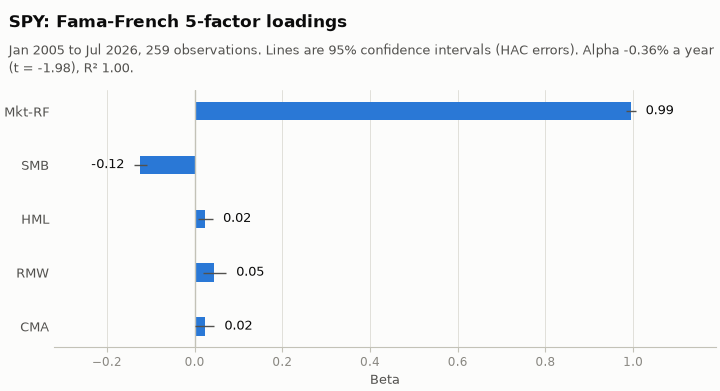

### SPY: t-statistics under different standard errors

|  | t (OLS) | t (White HC1) | t (NW, 4 lags) | t (NW, 12 lags) | p (OLS) | p (NW, 4 lags) | significance changes |
|:---|---:|---:|---:|---:|---:|---:|---:|
| alpha | -1.85 | -1.95 | -1.98 | -1.98 | 0.065 | 0.047 | yes |
| Mkt-RF | 252.72 | 208.56 | 178.57 | 147.32 | 4.1e-306 | 0.0e+00 |  |
| SMB | -17.63 | -16.34 | -17.08 | -14.77 | 6.3e-46 | 2.3e-65 |  |
| HML | 3.69 | 3.38 | 2.73 | 2.31 | 2.8e-04 | 0.006 |  |
| RMW | 5.59 | 4.34 | 3.33 | 2.89 | 6.0e-08 | 8.7e-04 |  |
| CMA | 2.22 | 2.01 | 2.08 | 2.25 | 0.027 | 0.037 |  |

Data: [spy-standard-errors.csv](spy-standard-errors.csv)

### SPY: return attribution

|  | return (ann.) | share of return | share of variance |
|:---|---:|---:|---:|
| alpha | -0.36% | -3.74% | 0.00% |
| Mkt-RF | 9.88% | 101.89% | 102.11% |
| SMB | 0.03% | 0.36% | -2.15% |
| HML | -0.00% | -0.04% | 0.20% |
| RMW | 0.14% | 1.47% | -0.36% |
| CMA | 0.01% | 0.06% | -0.14% |
| residual | -0.00% | -0.00% | 0.34% |
| total | 9.70% | 100.00% | 100.00% |

Data: [spy-attribution.csv](spy-attribution.csv)

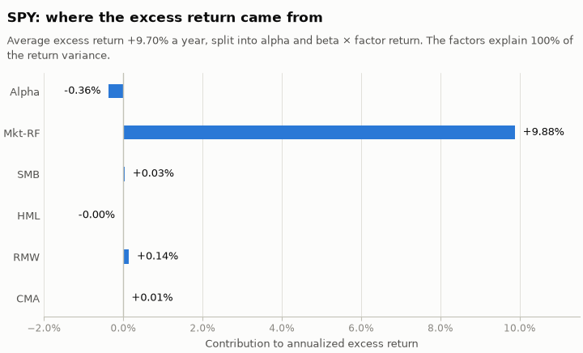

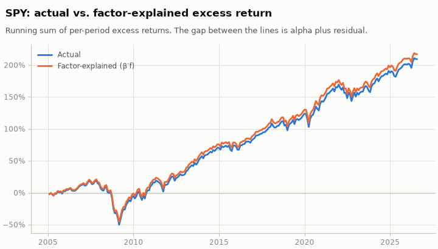

Chart data: [spy-cumulative.csv](spy-cumulative.csv)

### SPY: model comparison (common sample)

|  | alpha (ann.) | t(alpha) | Mkt-RF | SMB | HML | RMW | CMA | MOM | R2 | adj R2 | resid vol (ann.) | IR | N | BIC |
|:---|---:|---:|---:|---:|---:|---:|---:|---:|---:|---:|---:|---:|---:|---:|
| CAPM | 0.12% | 0.37 | 0.96 |  |  |  |  |  | 0.990 | 0.990 | 1.46% | 0.08 | 259 | -2088.95 |
| Fama-French 3-factor | -0.20% | -1.03 | 0.99 | -0.14 | 0.01 |  |  |  | 0.996 | 0.996 | 0.93% | -0.21 | 259 | -2315.96 |
| Carhart 4-factor | -0.18% | -0.95 | 0.99 | -0.14 | 0.01 |  |  | -0.00 | 0.996 | 0.996 | 0.93% | -0.20 | 259 | -2311.15 |
| Fama-French 5-factor | -0.36% | -1.98 | 0.99 | -0.12 | 0.02 | 0.05 | 0.02 |  | 0.997 | 0.996 | 0.88% | -0.41 | 259 | -2332.64 |
| Fama-French 6-factor | -0.35% | -1.92 | 0.99 | -0.12 | 0.02 | 0.04 | 0.02 | -0.00 | 0.997 | 0.996 | 0.88% | -0.39 | 259 | -2327.86 |

Data: [spy-models.csv](spy-models.csv)

### SPY: rolling 36-period estimates

|  | alpha (ann.) | Mkt-RF | SMB | HML | RMW | CMA | R2 |
|:---|---:|---:|---:|---:|---:|---:|---:|
| latest | -0.30% | 1.00 | -0.08 | 0.03 | 0.03 | 0.01 | 0.997 |
| mean | -0.28% | 0.99 | -0.12 | 0.01 | 0.06 | 0.03 | 0.997 |
| min | -1.58% | 0.95 | -0.16 | -0.04 | -0.02 | -0.06 | 0.985 |
| max | 0.41% | 1.04 | -0.07 | 0.06 | 0.12 | 0.07 | 0.999 |

Data: [spy-rolling-summary.csv](spy-rolling-summary.csv)

224 overlapping windows of 36 periods; the first ends Dec 2007 and the last Jul 2026. Shaded bands in the chart are estimate ± 1.96 standard errors (HC3, MacKinnon-White) for each window on its own: they are pointwise, not joint, and neighbouring windows share 35 of 36 observations.

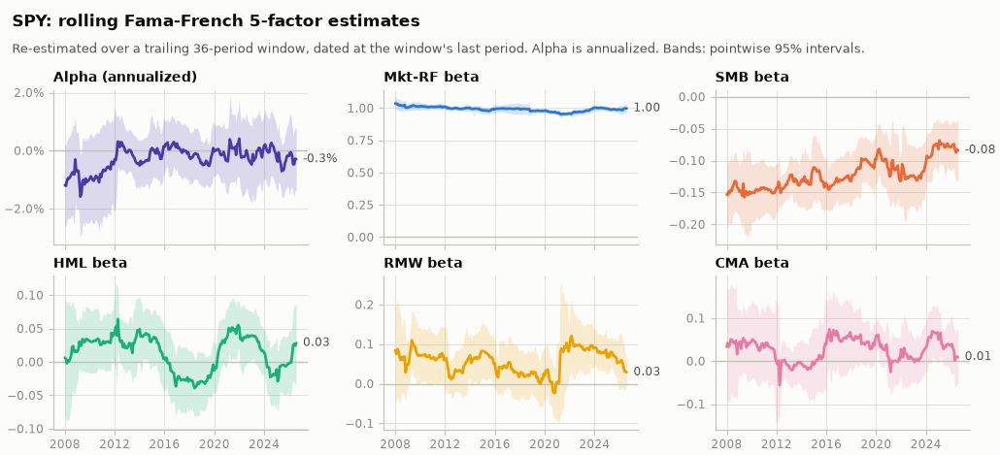

Chart data: [spy-rolling.csv](spy-rolling.csv)

### SPY: did the exposures change? (7 separate 36-period blocks)

|  | lowest block | highest block | chi2 | p-value |
|:---|---:|---:|---:|---:|
| alpha (ann.) | -0.8% | 0.1% | 1.27 | 0.973 |
| Mkt-RF | 0.97 | 1.02 | 14.59 | 0.024 |
| SMB | -0.15 | -0.08 | 6.76 | 0.344 |
| HML | -0.03 | 0.04 | 4.99 | 0.546 |
| RMW | 0.00 | 0.09 | 5.56 | 0.474 |
| CMA | -0.02 | 0.05 | 2.11 | 0.910 |

Data: [spy-stability.csv](spy-stability.csv)

Blocks run from Aug 2005 to Jul 2026 and do not overlap. Each row tests that one coefficient is the same in all 7 blocks (Wald chi-squared, 6 degrees of freedom, HC3, MacKinnon-White within each block). A small p-value says the exposure moved by more than estimation noise; a large one says the rolling chart's wiggles are consistent with a constant exposure.

## IWN

Jan 2005 to Jul 2026, 259 observations. Alpha -1.33% a year (t = -2.22), R² 0.982, adjusted R² 0.982, residual volatility 2.70%, information ratio -0.49.

|  | coef | std err | t | p-value | ci low (95%) | ci high (95%) |
|:---|---:|---:|---:|---:|---:|---:|
| alpha | -0.0011 | 0.0005 | -2.2155 | 0.0267 | -0.0021 | -0.0001 |
| Mkt-RF | 0.9611 | 0.0134 | 71.6942 | 0.0000 | 0.9349 | 0.9874 |
| SMB | 0.8213 | 0.0246 | 33.3412 | 0.0000 | 0.7730 | 0.8695 |
| HML | 0.3617 | 0.0251 | 14.4221 | 0.0000 | 0.3126 | 0.4109 |
| RMW | 0.0241 | 0.0262 | 0.9202 | 0.3575 | -0.0272 | 0.0755 |
| CMA | 0.0114 | 0.0344 | 0.3300 | 0.7414 | -0.0561 | 0.0789 |

Data: [iwn-coefficients.csv](iwn-coefficients.csv)

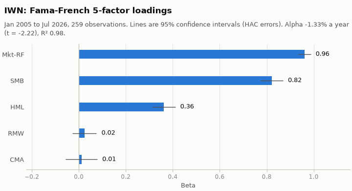

### IWN: t-statistics under different standard errors

|  | t (OLS) | t (White HC1) | t (NW, 4 lags) | t (NW, 12 lags) | p (OLS) | p (NW, 4 lags) | significance changes |
|:---|---:|---:|---:|---:|---:|---:|---:|
| alpha | -2.22 | -2.16 | -2.22 | -2.32 | 0.027 | 0.027 |  |
| Mkt-RF | 79.72 | 63.67 | 71.69 | 68.33 | 2.9e-181 | 0.0e+00 |  |
| SMB | 38.26 | 32.65 | 33.34 | 35.45 | 3.5e-107 | 9.8e-244 |  |
| HML | 17.84 | 14.99 | 14.42 | 13.64 | 1.2e-46 | 3.8e-47 |  |
| RMW | 0.97 | 0.90 | 0.92 | 1.06 | 0.332 | 0.357 |  |
| CMA | 0.36 | 0.33 | 0.33 | 0.32 | 0.722 | 0.741 |  |

Data: [iwn-standard-errors.csv](iwn-standard-errors.csv)

### IWN: return attribution

|  | return (ann.) | share of return | share of variance |
|:---|---:|---:|---:|
| alpha | -1.33% | -16.64% | 0.00% |
| Mkt-RF | 9.55% | 119.28% | 64.48% |
| SMB | -0.23% | -2.89% | 25.97% |
| HML | -0.06% | -0.74% | 7.99% |
| RMW | 0.08% | 0.95% | -0.21% |
| CMA | 0.00% | 0.04% | 0.01% |
| residual | -0.00% | -0.00% | 1.76% |
| total | 8.00% | 100.00% | 100.00% |

Data: [iwn-attribution.csv](iwn-attribution.csv)

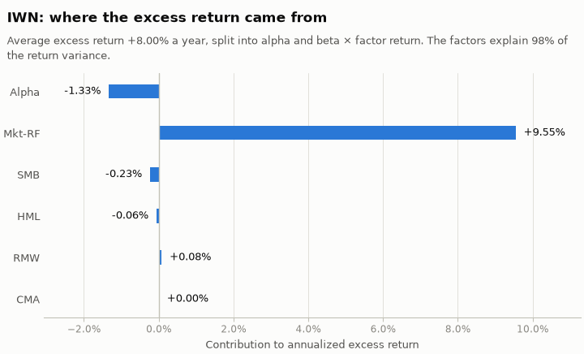

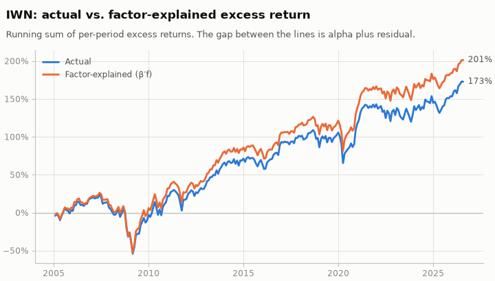

Chart data: [iwn-cumulative.csv](iwn-cumulative.csv)

### IWN: model comparison (common sample)

|  | alpha (ann.) | t(alpha) | Mkt-RF | SMB | HML | RMW | CMA | MOM | R2 | adj R2 | resid vol (ann.) | IR | N | BIC |
|:---|---:|---:|---:|---:|---:|---:|---:|---:|---:|---:|---:|---:|---:|---:|
| CAPM | -3.49% | -1.54 | 1.16 |  |  |  |  |  | 0.777 | 0.776 | 9.53% | -0.37 | 259 | -1117.41 |
| Fama-French 3-factor | -1.10% | -1.70 | 0.97 | 0.82 | 0.52 |  |  |  | 0.980 | 0.980 | 2.83% | -0.39 | 259 | -1736.12 |
| Carhart 4-factor | -1.11% | -1.67 | 0.97 | 0.82 | 0.52 |  |  | 0.00 | 0.980 | 0.980 | 2.84% | -0.39 | 259 | -1730.65 |
| Fama-French 5-factor | -1.33% | -2.22 | 0.96 | 0.82 | 0.36 | 0.02 | 0.01 |  | 0.982 | 0.982 | 2.70% | -0.49 | 259 | -1752.78 |
| Fama-French 6-factor | -1.39% | -2.22 | 0.96 | 0.82 | 0.37 | 0.03 | 0.01 | 0.01 | 0.982 | 0.982 | 2.70% | -0.51 | 259 | -1748.16 |

Data: [iwn-models.csv](iwn-models.csv)

### IWN: rolling 36-period estimates

|  | alpha (ann.) | Mkt-RF | SMB | HML | RMW | CMA | R2 |
|:---|---:|---:|---:|---:|---:|---:|---:|
| latest | -0.63% | 0.99 | 0.84 | 0.44 | -0.00 | 0.04 | 0.985 |
| mean | -1.46% | 0.97 | 0.81 | 0.36 | 0.07 | 0.04 | 0.984 |
| min | -4.88% | 0.91 | 0.68 | 0.15 | -0.12 | -0.16 | 0.956 |
| max | 1.83% | 1.08 | 0.96 | 0.60 | 0.27 | 0.25 | 0.994 |

Data: [iwn-rolling-summary.csv](iwn-rolling-summary.csv)

224 overlapping windows of 36 periods; the first ends Dec 2007 and the last Jul 2026. Shaded bands in the chart are estimate ± 1.96 standard errors (HC3, MacKinnon-White) for each window on its own: they are pointwise, not joint, and neighbouring windows share 35 of 36 observations.

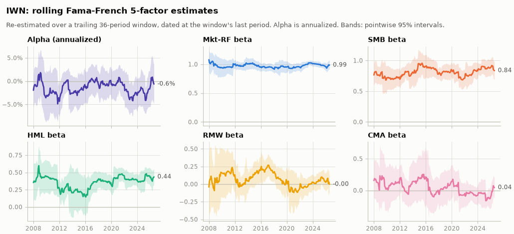

Chart data: [iwn-rolling.csv](iwn-rolling.csv)

### IWN: did the exposures change? (7 separate 36-period blocks)

|  | lowest block | highest block | chi2 | p-value |
|:---|---:|---:|---:|---:|
| alpha (ann.) | -3.0% | 0.4% | 3.01 | 0.808 |
| Mkt-RF | 0.93 | 1.05 | 7.76 | 0.256 |
| SMB | 0.72 | 0.84 | 2.44 | 0.875 |
| HML | 0.25 | 0.44 | 1.69 | 0.946 |
| RMW | -0.10 | 0.24 | 8.96 | 0.176 |
| CMA | -0.07 | 0.15 | 3.87 | 0.694 |

Data: [iwn-stability.csv](iwn-stability.csv)

Blocks run from Aug 2005 to Jul 2026 and do not overlap. Each row tests that one coefficient is the same in all 7 blocks (Wald chi-squared, 6 degrees of freedom, HC3, MacKinnon-White within each block). A small p-value says the exposure moved by more than estimation noise; a large one says the rolling chart's wiggles are consistent with a constant exposure.

## BRK-B

Jan 2005 to Jul 2026, 259 observations. Alpha +2.76% a year (t = 1.03), R² 0.396, adjusted R² 0.384, residual volatility 13.63%, information ratio 0.20.

|  | coef | std err | t | p-value | ci low (95%) | ci high (95%) |
|:---|---:|---:|---:|---:|---:|---:|
| alpha | 0.0023 | 0.0022 | 1.0287 | 0.3036 | -0.0021 | 0.0067 |
| Mkt-RF | 0.6812 | 0.0823 | 8.2731 | 0.0000 | 0.5198 | 0.8426 |
| SMB | -0.3614 | 0.0988 | -3.6574 | 0.0003 | -0.5550 | -0.1677 |
| HML | 0.4310 | 0.1189 | 3.6254 | 0.0003 | 0.1980 | 0.6640 |
| RMW | 0.0852 | 0.1082 | 0.7873 | 0.4311 | -0.1269 | 0.2972 |
| CMA | 0.0968 | 0.1737 | 0.5569 | 0.5776 | -0.2438 | 0.4373 |

Data: [brk-b-coefficients.csv](brk-b-coefficients.csv)

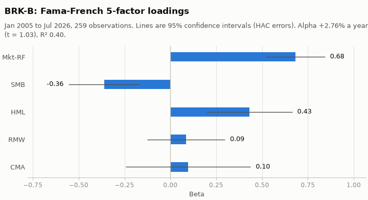

### BRK-B: t-statistics under different standard errors

|  | t (OLS) | t (White HC1) | t (NW, 4 lags) | t (NW, 12 lags) | p (OLS) | p (NW, 4 lags) | significance changes |
|:---|---:|---:|---:|---:|---:|---:|---:|
| alpha | 0.91 | 0.86 | 1.03 | 1.15 | 0.364 | 0.304 |  |
| Mkt-RF | 11.18 | 8.86 | 8.27 | 7.45 | 7.5e-24 | 1.3e-16 |  |
| SMB | -3.33 | -3.59 | -3.66 | -4.26 | 9.9e-04 | 2.5e-04 |  |
| HML | 4.21 | 4.00 | 3.63 | 3.64 | 3.6e-05 | 2.9e-04 |  |
| RMW | 0.68 | 0.74 | 0.79 | 0.83 | 0.497 | 0.431 |  |
| CMA | 0.60 | 0.58 | 0.56 | 0.60 | 0.549 | 0.578 |  |

Data: [brk-b-standard-errors.csv](brk-b-standard-errors.csv)

### BRK-B: return attribution

|  | return (ann.) | share of return | share of variance |
|:---|---:|---:|---:|
| alpha | 2.76% | 28.00% | 0.00% |
| Mkt-RF | 6.77% | 68.70% | 33.05% |
| SMB | 0.10% | 1.03% | -1.93% |
| HML | -0.07% | -0.71% | 8.18% |
| RMW | 0.27% | 2.72% | -0.04% |
| CMA | 0.03% | 0.27% | 0.38% |
| residual | -0.00% | -0.00% | 60.36% |
| total | 9.85% | 100.00% | 100.00% |

Data: [brk-b-attribution.csv](brk-b-attribution.csv)

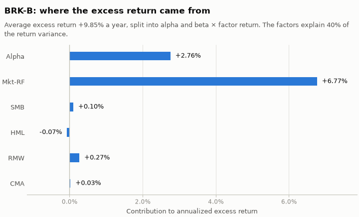

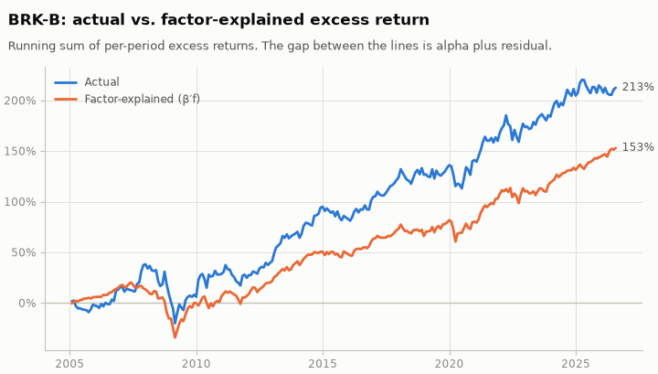

Chart data: [brk-b-cumulative.csv](brk-b-cumulative.csv)

### BRK-B: model comparison (common sample)

|  | alpha (ann.) | t(alpha) | Mkt-RF | SMB | HML | RMW | CMA | MOM | R2 | adj R2 | resid vol (ann.) | IR | N | BIC |
|:---|---:|---:|---:|---:|---:|---:|---:|---:|---:|---:|---:|---:|---:|---:|
| CAPM | 3.66% | 1.21 | 0.62 |  |  |  |  |  | 0.303 | 0.300 | 14.54% | 0.25 | 259 | -898.40 |
| Fama-French 3-factor | 3.01% | 1.17 | 0.67 | -0.44 | 0.41 |  |  |  | 0.402 | 0.395 | 13.51% | 0.22 | 259 | -927.23 |
| Carhart 4-factor | 3.21% | 1.22 | 0.66 | -0.44 | 0.39 |  |  | -0.05 | 0.404 | 0.394 | 13.52% | 0.24 | 259 | -922.25 |
| Fama-French 5-factor | 2.76% | 1.03 | 0.68 | -0.36 | 0.43 | 0.09 | 0.10 |  | 0.396 | 0.384 | 13.63% | 0.20 | 259 | -913.59 |
| Fama-French 6-factor | 2.99% | 1.08 | 0.67 | -0.37 | 0.41 | 0.07 | 0.11 | -0.05 | 0.398 | 0.383 | 13.64% | 0.22 | 259 | -908.64 |

Data: [brk-b-models.csv](brk-b-models.csv)

### BRK-B: rolling 36-period estimates

|  | alpha (ann.) | Mkt-RF | SMB | HML | RMW | CMA | R2 |
|:---|---:|---:|---:|---:|---:|---:|---:|
| latest | -5.65% | 0.48 | -0.39 | 1.04 | 0.13 | -0.07 | 0.232 |
| mean | 5.57% | 0.69 | -0.44 | 0.33 | -0.35 | 0.15 | 0.554 |
| min | -9.63% | -0.13 | -1.05 | -1.20 | -2.69 | -0.83 | 0.130 |
| max | 26.31% | 1.13 | 0.06 | 1.11 | 0.67 | 1.33 | 0.821 |

Data: [brk-b-rolling-summary.csv](brk-b-rolling-summary.csv)

224 overlapping windows of 36 periods; the first ends Dec 2007 and the last Jul 2026. Shaded bands in the chart are estimate ± 1.96 standard errors (HC3, MacKinnon-White) for each window on its own: they are pointwise, not joint, and neighbouring windows share 35 of 36 observations.

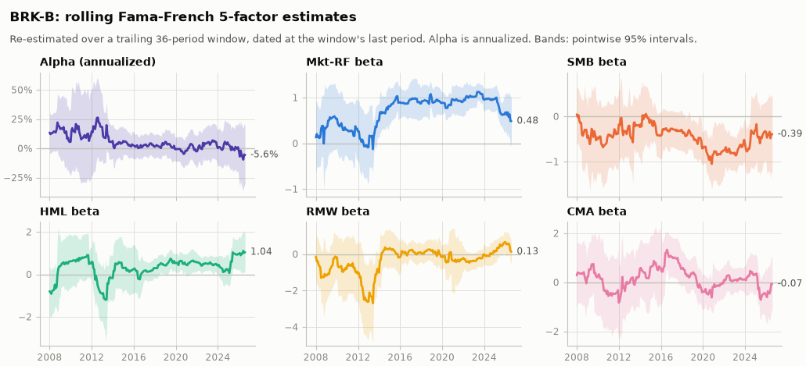

Chart data: [brk-b-rolling.csv](brk-b-rolling.csv)

### BRK-B: did the exposures change? (7 separate 36-period blocks)

|  | lowest block | highest block | chi2 | p-value |
|:---|---:|---:|---:|---:|
| alpha (ann.) | -5.6% | 13.6% | 3.12 | 0.794 |
| Mkt-RF | 0.16 | 1.11 | 15.60 | 0.016 |
| SMB | -0.96 | 0.06 | 8.36 | 0.213 |
| HML | -0.66 | 1.04 | 10.49 | 0.106 |
| RMW | -1.24 | 0.38 | 5.64 | 0.465 |
| CMA | -0.47 | 0.99 | 7.76 | 0.256 |

Data: [brk-b-stability.csv](brk-b-stability.csv)

Blocks run from Aug 2005 to Jul 2026 and do not overlap. Each row tests that one coefficient is the same in all 7 blocks (Wald chi-squared, 6 degrees of freedom, HC3, MacKinnon-White within each block). A small p-value says the exposure moved by more than estimation noise; a large one says the rolling chart's wiggles are consistent with a constant exposure.

## AAPL

Jan 2005 to Jul 2026, 259 observations. Alpha +15.83% a year (t = 2.95), R² 0.402, adjusted R² 0.390, residual volatility 23.97%, information ratio 0.66.

|  | coef | std err | t | p-value | ci low (95%) | ci high (95%) |
|:---|---:|---:|---:|---:|---:|---:|
| alpha | 0.0132 | 0.0045 | 2.9538 | 0.0031 | 0.0044 | 0.0219 |
| Mkt-RF | 1.2371 | 0.1062 | 11.6534 | 0.0000 | 1.0290 | 1.4451 |
| SMB | -0.1189 | 0.1620 | -0.7342 | 0.4629 | -0.4365 | 0.1986 |
| HML | -0.4398 | 0.1896 | -2.3198 | 0.0204 | -0.8114 | -0.0682 |
| RMW | 0.6216 | 0.2019 | 3.0789 | 0.0021 | 0.2259 | 1.0174 |
| CMA | -0.4348 | 0.2974 | -1.4621 | 0.1437 | -1.0178 | 0.1481 |

Data: [aapl-coefficients.csv](aapl-coefficients.csv)

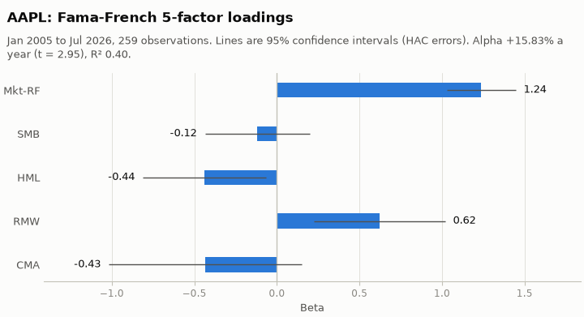

### AAPL: t-statistics under different standard errors

|  | t (OLS) | t (White HC1) | t (NW, 4 lags) | t (NW, 12 lags) | p (OLS) | p (NW, 4 lags) | significance changes |
|:---|---:|---:|---:|---:|---:|---:|---:|
| alpha | 2.97 | 2.91 | 2.95 | 3.03 | 0.003 | 0.003 |  |
| Mkt-RF | 11.55 | 10.28 | 11.65 | 11.73 | 4.8e-25 | 2.2e-31 |  |
| SMB | -0.62 | -0.66 | -0.73 | -0.71 | 0.534 | 0.463 |  |
| HML | -2.44 | -2.18 | -2.32 | -2.19 | 0.015 | 0.020 |  |
| RMW | 2.82 | 2.97 | 3.08 | 3.22 | 0.005 | 0.002 |  |
| CMA | -1.53 | -1.53 | -1.46 | -1.32 | 0.126 | 0.144 |  |

Data: [aapl-standard-errors.csv](aapl-standard-errors.csv)

### AAPL: return attribution

|  | return (ann.) | share of return | share of variance |
|:---|---:|---:|---:|
| alpha | 15.83% | 52.67% | 0.00% |
| Mkt-RF | 12.29% | 40.88% | 35.36% |
| SMB | 0.03% | 0.11% | -0.27% |
| HML | 0.07% | 0.24% | 2.45% |
| RMW | 1.95% | 6.50% | 0.15% |
| CMA | -0.12% | -0.39% | 2.51% |
| residual | -0.00% | -0.00% | 59.80% |
| total | 30.06% | 100.00% | 100.00% |

Data: [aapl-attribution.csv](aapl-attribution.csv)

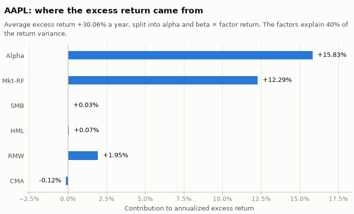

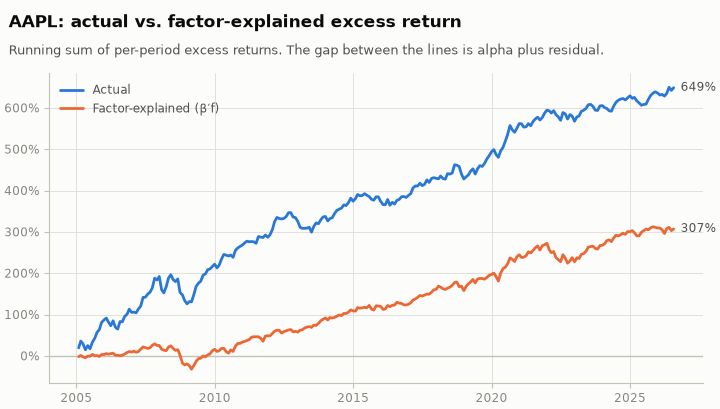

Chart data: [aapl-cumulative.csv](aapl-cumulative.csv)

### AAPL: model comparison (common sample)

|  | alpha (ann.) | t(alpha) | Mkt-RF | SMB | HML | RMW | CMA | MOM | R2 | adj R2 | resid vol (ann.) | IR | N | BIC |
|:---|---:|---:|---:|---:|---:|---:|---:|---:|---:|---:|---:|---:|---:|---:|
| CAPM | 18.66% | 3.28 | 1.15 |  |  |  |  |  | 0.328 | 0.326 | 25.21% | 0.74 | 259 | -613.22 |
| Fama-French 3-factor | 17.50% | 3.33 | 1.24 | -0.26 | -0.59 |  |  |  | 0.380 | 0.373 | 24.31% | 0.72 | 259 | -622.91 |
| Carhart 4-factor | 17.70% | 3.33 | 1.23 | -0.27 | -0.61 |  |  | -0.05 | 0.380 | 0.371 | 24.35% | 0.73 | 259 | -617.53 |
| Fama-French 5-factor | 15.83% | 2.95 | 1.24 | -0.12 | -0.44 | 0.62 | -0.43 |  | 0.402 | 0.390 | 23.97% | 0.66 | 259 | -621.14 |
| Fama-French 6-factor | 15.79% | 2.89 | 1.24 | -0.12 | -0.44 | 0.62 | -0.44 | 0.01 | 0.402 | 0.388 | 24.02% | 0.66 | 259 | -615.59 |

Data: [aapl-models.csv](aapl-models.csv)

### AAPL: rolling 36-period estimates

|  | alpha (ann.) | Mkt-RF | SMB | HML | RMW | CMA | R2 |
|:---|---:|---:|---:|---:|---:|---:|---:|
| latest | 1.24% | 0.85 | -0.01 | 0.01 | 0.19 | -0.30 | 0.264 |
| mean | 14.10% | 1.29 | -0.12 | -0.36 | 0.86 | -1.11 | 0.552 |
| min | -9.22% | 0.45 | -1.69 | -1.81 | -0.85 | -3.56 | 0.243 |
| max | 49.35% | 3.01 | 0.53 | 1.03 | 2.96 | 1.24 | 0.813 |

Data: [aapl-rolling-summary.csv](aapl-rolling-summary.csv)

224 overlapping windows of 36 periods; the first ends Dec 2007 and the last Jul 2026. Shaded bands in the chart are estimate ± 1.96 standard errors (HC3, MacKinnon-White) for each window on its own: they are pointwise, not joint, and neighbouring windows share 35 of 36 observations.

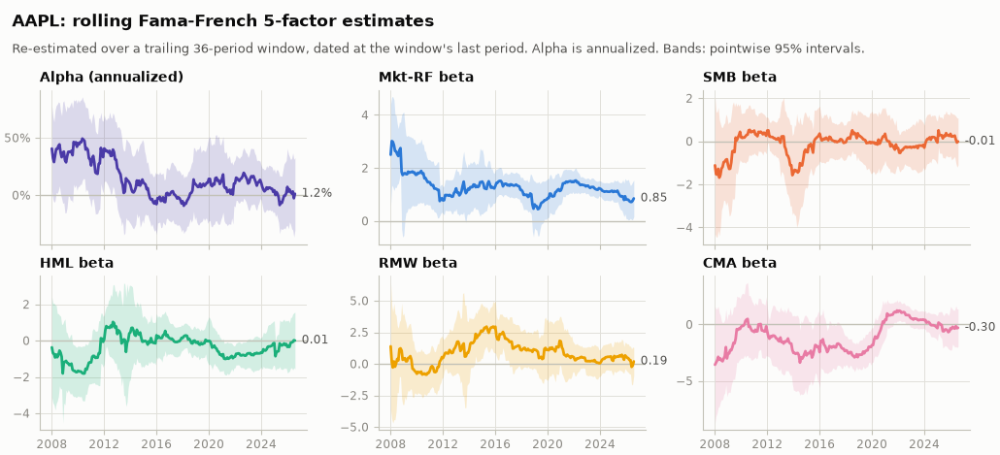

Chart data: [aapl-rolling.csv](aapl-rolling.csv)

### AAPL: did the exposures change? (7 separate 36-period blocks)

|  | lowest block | highest block | chi2 | p-value |
|:---|---:|---:|---:|---:|
| alpha (ann.) | -2.9% | 44.3% | 5.65 | 0.464 |
| Mkt-RF | 0.85 | 2.45 | 7.00 | 0.321 |
| SMB | -1.19 | 0.40 | 3.75 | 0.711 |
| HML | -0.71 | 0.42 | 2.25 | 0.896 |
| RMW | -0.26 | 2.05 | 4.66 | 0.588 |
| CMA | -3.26 | 0.37 | 11.20 | 0.082 |

Data: [aapl-stability.csv](aapl-stability.csv)

Blocks run from Aug 2005 to Jul 2026 and do not overlap. Each row tests that one coefficient is the same in all 7 blocks (Wald chi-squared, 6 degrees of freedom, HC3, MacKinnon-White within each block). A small p-value says the exposure moved by more than estimation noise; a large one says the rolling chart's wiggles are consistent with a constant exposure.

## Portfolio

Jan 2005 to Jul 2026, 259 observations. Alpha -0.75% a year (t = -2.58), R² 0.994, adjusted R² 0.994, residual volatility 1.30%, information ratio -0.58.

|  | coef | std err | t | p-value | ci low (95%) | ci high (95%) |
|:---|---:|---:|---:|---:|---:|---:|
| alpha | -0.0006 | 0.0002 | -2.5809 | 0.0099 | -0.0011 | -0.0002 |
| Mkt-RF | 0.9813 | 0.0069 | 142.7386 | 0.0000 | 0.9678 | 0.9948 |
| SMB | 0.2544 | 0.0125 | 20.3703 | 0.0000 | 0.2299 | 0.2788 |
| HML | 0.1593 | 0.0126 | 12.6895 | 0.0000 | 0.1347 | 0.1840 |
| RMW | 0.0368 | 0.0163 | 2.2594 | 0.0239 | 0.0049 | 0.0687 |
| CMA | 0.0184 | 0.0168 | 1.0981 | 0.2722 | -0.0145 | 0.0514 |

Data: [portfolio-coefficients.csv](portfolio-coefficients.csv)

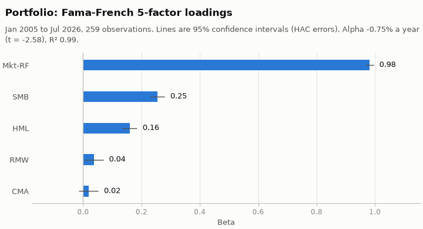

### Portfolio: t-statistics under different standard errors

|  | t (OLS) | t (White HC1) | t (NW, 4 lags) | t (NW, 12 lags) | p (OLS) | p (NW, 4 lags) | significance changes |
|:---|---:|---:|---:|---:|---:|---:|---:|
| alpha | -2.60 | -2.61 | -2.58 | -2.64 | 0.010 | 0.010 |  |
| Mkt-RF | 168.95 | 144.66 | 142.74 | 125.93 | 3.9e-262 | 0.0e+00 |  |
| SMB | 24.60 | 20.99 | 20.37 | 19.32 | 4.8e-69 | 3.1e-92 |  |
| HML | 16.31 | 14.04 | 12.69 | 11.22 | 2.4e-41 | 6.8e-37 |  |
| RMW | 3.08 | 2.61 | 2.26 | 2.28 | 0.002 | 0.024 |  |
| CMA | 1.20 | 1.08 | 1.10 | 1.06 | 0.231 | 0.272 |  |

Data: [portfolio-standard-errors.csv](portfolio-standard-errors.csv)

### Portfolio: return attribution

|  | return (ann.) | share of return | share of variance |
|:---|---:|---:|---:|
| alpha | -0.75% | -8.32% | 0.00% |
| Mkt-RF | 9.75% | 108.06% | 89.91% |
| SMB | -0.07% | -0.79% | 7.08% |
| HML | -0.03% | -0.29% | 2.78% |
| RMW | 0.12% | 1.28% | -0.34% |
| CMA | 0.00% | 0.06% | -0.04% |
| residual | -0.00% | -0.00% | 0.62% |
| total | 9.02% | 100.00% | 100.00% |

Data: [portfolio-attribution.csv](portfolio-attribution.csv)

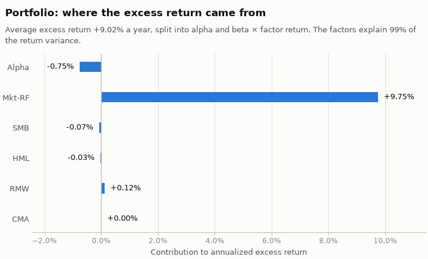

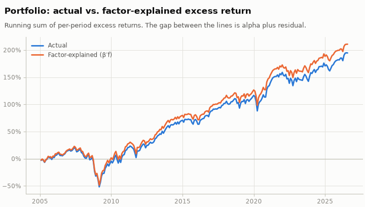

Chart data: [portfolio-cumulative.csv](portfolio-cumulative.csv)

### Portfolio: model comparison (common sample)

|  | alpha (ann.) | t(alpha) | Mkt-RF | SMB | HML | RMW | CMA | MOM | R2 | adj R2 | resid vol (ann.) | IR | N | BIC |
|:---|---:|---:|---:|---:|---:|---:|---:|---:|---:|---:|---:|---:|---:|---:|
| CAPM | -1.32% | -1.51 | 1.04 |  |  |  |  |  | 0.955 | 0.955 | 3.48% | -0.38 | 259 | -1638.55 |
| Fama-French 3-factor | -0.56% | -1.80 | 0.98 | 0.24 | 0.22 |  |  |  | 0.993 | 0.993 | 1.37% | -0.41 | 259 | -2112.68 |
| Carhart 4-factor | -0.55% | -1.77 | 0.98 | 0.24 | 0.22 |  |  | -0.00 | 0.993 | 0.993 | 1.37% | -0.40 | 259 | -2107.13 |
| Fama-French 5-factor | -0.75% | -2.58 | 0.98 | 0.25 | 0.16 | 0.04 | 0.02 |  | 0.994 | 0.994 | 1.30% | -0.58 | 259 | -2131.11 |
| Fama-French 6-factor | -0.76% | -2.61 | 0.98 | 0.25 | 0.16 | 0.04 | 0.02 | 0.00 | 0.994 | 0.994 | 1.30% | -0.59 | 259 | -2125.75 |

Data: [portfolio-models.csv](portfolio-models.csv)

### Portfolio: rolling 36-period estimates

|  | alpha (ann.) | Mkt-RF | SMB | HML | RMW | CMA | R2 |
|:---|---:|---:|---:|---:|---:|---:|---:|
| latest | -0.43% | 0.99 | 0.28 | 0.19 | 0.02 | 0.02 | 0.994 |
| mean | -0.75% | 0.98 | 0.25 | 0.15 | 0.06 | 0.03 | 0.994 |
| min | -2.18% | 0.95 | 0.18 | 0.06 | -0.05 | -0.05 | 0.982 |
| max | 0.54% | 1.05 | 0.32 | 0.25 | 0.14 | 0.12 | 0.998 |

Data: [portfolio-rolling-summary.csv](portfolio-rolling-summary.csv)

224 overlapping windows of 36 periods; the first ends Dec 2007 and the last Jul 2026. Shaded bands in the chart are estimate ± 1.96 standard errors (HC3, MacKinnon-White) for each window on its own: they are pointwise, not joint, and neighbouring windows share 35 of 36 observations.

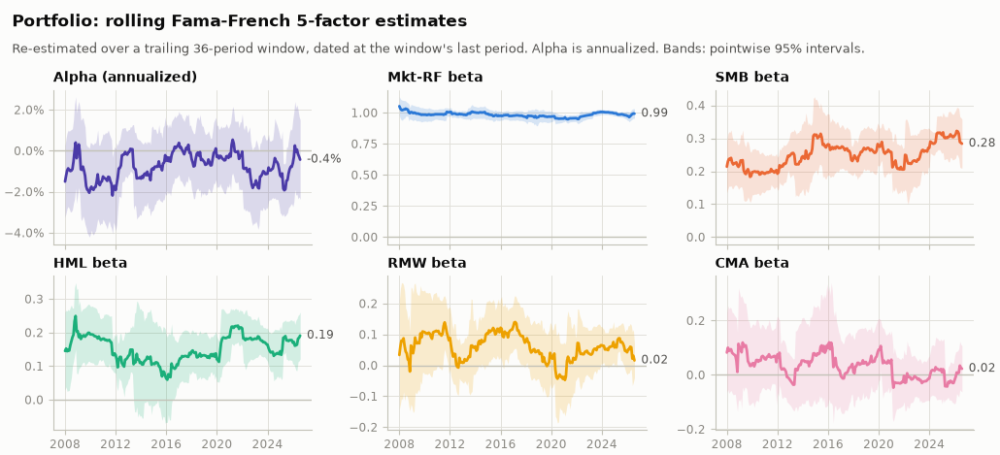

Chart data: [portfolio-rolling.csv](portfolio-rolling.csv)

### Portfolio: did the exposures change? (7 separate 36-period blocks)

|  | lowest block | highest block | chi2 | p-value |
|:---|---:|---:|---:|---:|
| alpha (ann.) | -1.5% | 0.2% | 2.37 | 0.883 |
| Mkt-RF | 0.95 | 1.03 | 7.69 | 0.262 |
| SMB | 0.20 | 0.28 | 5.46 | 0.486 |
| HML | 0.12 | 0.19 | 2.12 | 0.909 |
| RMW | -0.04 | 0.14 | 8.19 | 0.225 |
| CMA | -0.02 | 0.07 | 2.98 | 0.812 |

Data: [portfolio-stability.csv](portfolio-stability.csv)

Blocks run from Aug 2005 to Jul 2026 and do not overlap. Each row tests that one coefficient is the same in all 7 blocks (Wald chi-squared, 6 degrees of freedom, HC3, MacKinnon-White within each block). A small p-value says the exposure moved by more than estimation noise; a large one says the rolling chart's wiggles are consistent with a constant exposure.
