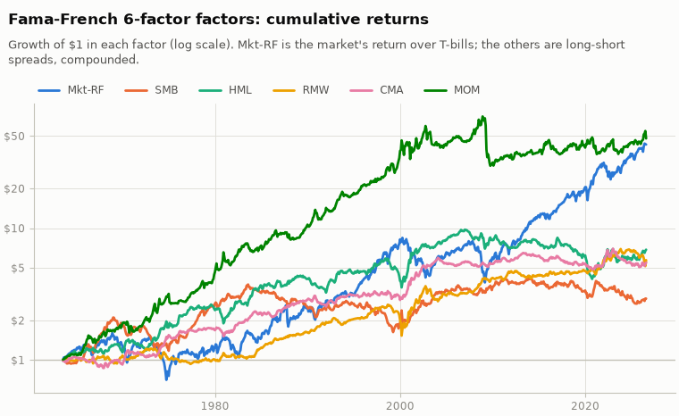

# Fama-French 6-factor factors

Monthly factor returns, Jul 1963 to Jul 2026 (757 periods). Source: Kenneth R. French Data Library (saved snapshot `snapshot-2026-09-29`, downloaded 2026-09-29).

## Summary statistics

|  | mean (ann.) | vol (ann.) | Sharpe (ann.) | t(mean) | worst period | best period | N |
|:---|---:|---:|---:|---:|---:|---:|---:|
| Mkt-RF | 7.19% | 15.45% | 0.47 | 3.70 | -23.19% | 16.10% | 757 |
| SMB | 2.25% | 10.47% | 0.21 | 1.71 | -15.53% | 18.54% | 757 |
| HML | 3.59% | 10.28% | 0.35 | 2.77 | -13.83% | 12.86% | 757 |
| RMW | 3.09% | 7.91% | 0.39 | 3.10 | -18.93% | 13.04% | 757 |
| CMA | 2.96% | 7.18% | 0.41 | 3.27 | -7.06% | 9.00% | 757 |
| MOM | 7.26% | 14.56% | 0.50 | 3.96 | -34.36% | 18.05% | 757 |

Data: [summary.csv](summary.csv)

## Correlations

|  | Mkt-RF | SMB | HML | RMW | CMA | MOM |
|:---|---:|---:|---:|---:|---:|---:|
| Mkt-RF | 1.00 | 0.27 | -0.21 | -0.19 | -0.36 | -0.16 |
| SMB | 0.27 | 1.00 | 0.02 | -0.33 | -0.08 | -0.08 |
| HML | -0.21 | 0.02 | 1.00 | 0.09 | 0.68 | -0.19 |
| RMW | -0.19 | -0.33 | 0.09 | 1.00 | 0.02 | 0.05 |
| CMA | -0.36 | -0.08 | 0.68 | 0.02 | 1.00 | -0.02 |
| MOM | -0.16 | -0.08 | -0.19 | 0.05 | -0.02 | 1.00 |

Data: [correlations.csv](correlations.csv)

## Spanning regressions: each factor on the others

|  | alpha (ann.) | t(alpha) | Mkt-RF | SMB | HML | RMW | CMA | MOM | R2 |
|:---|---:|---:|---:|---:|---:|---:|---:|---:|---:|
| Mkt-RF | 10.54% | 6.06 |  | 0.29 | 0.01 | -0.22 | -0.74 | -0.16 | 0.222 |
| SMB | 2.34% | 1.74 | 0.14 |  | 0.16 | -0.40 | -0.15 | -0.00 | 0.168 |
| HML | 0.89% | 0.75 | 0.00 | 0.09 |  | 0.16 | 0.98 | -0.13 | 0.513 |
| RMW | 3.95% | 4.22 | -0.06 | -0.24 | 0.16 |  | -0.22 | 0.02 | 0.145 |
| CMA | 2.13% | 2.88 | -0.10 | -0.04 | 0.46 | -0.10 |  | 0.04 | 0.528 |
| MOM | 8.99% | 4.30 | -0.16 | -0.00 | -0.47 | 0.09 | 0.29 |  | 0.091 |

Data: [spanning.csv](spanning.csv)

A factor with an insignificant alpha here is explained by the others and adds little to the model.

Chart data: [growth.csv](growth.csv)
