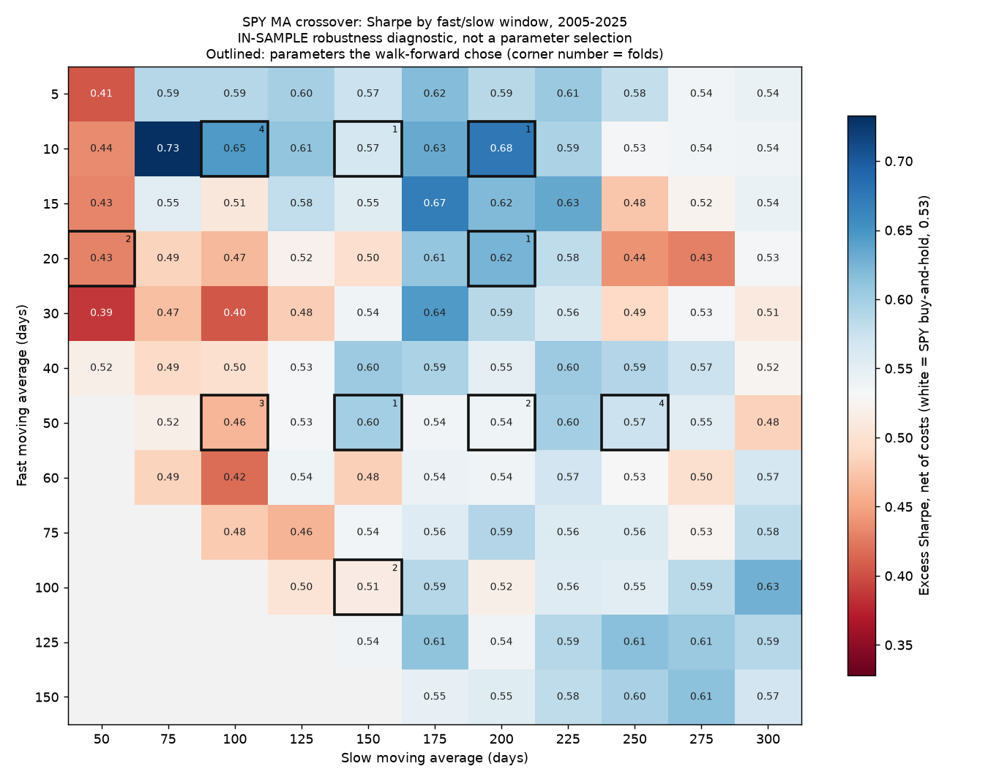

# quantbt

An event-driven backtesting framework in Python, built around one rule: **a backtest
should be hard to fool yourself with.** It began as a 60-line moving-average script whose
results were inflated by a same-bar fill, no transaction costs and no out-of-sample
discipline. Those bugs, and their measured effect, are documented in
[AUDIT.md](AUDIT.md).

Five strategies run on it. Four lose to buying and holding the index. The fifth, the MA
crossover, edges it on Sharpe (0.58 vs 0.53 over the same dates) by far less than the
noise, and [RESULTS.md](RESULTS.md) says so in the first paragraph.

```bash
python3.12 -m venv .venv && .venv/bin/pip install -r requirements.txt
.venv/bin/python -m pytest              # 140 tests, 98% coverage, offline
.venv/bin/ruff check . && .venv/bin/mypy    # both clean, mypy in strict mode
.venv/bin/python scripts/run_ma_crossover.py
.venv/bin/python scripts/ma_sensitivity.py     # parameter heatmap, ~10 s
.venv/bin/python scripts/multiple_testing.py   # deflated Sharpe over all 63 trials, ~3 s
.venv/bin/python scripts/run_strategies.py     # all five strategies, ~26 min
```

Every script reads the committed data snapshot and runs offline; add `--live-data` to
re-download instead.

## Results

Out-of-sample walk-forward results, net of 5 bp slippage, 1 bp commission and short
borrow fees. Parameters are re-chosen each year on the previous 5 years only. Data: Yahoo
Finance daily bars through 2025-08-29, downloaded 2026-09-28 and committed as a hash-checked
snapshot in [data/snapshot-2026-09-28/](data/README.md), so every number here reproduces
offline. The benchmark is buy-and-hold
SPY over the same dates. `ma_crossover` starts in 2005, and the others start in 2010 after
their first training window.

| Strategy | CAGR | Vol | **Sharpe** | Sortino | Max DD | DD days | Turnover | Exposure |
|---|---|---|---|---|---|---|---|---|
| SPY buy & hold (2010-2025) | 13.8% | 17.3% | **0.76** | 1.07 | -33.7% | 709 | 0.0 | 100% |
| ma_crossover | 8.2% | 12.0% | **0.58** | 0.79 | -22.4% | 808 | 2.0 | 78% |
| mean_reversion | 6.6% | 13.9% | **0.44** | 0.62 | -39.6% | 1,102 | 10.4 | 32% |
| xsmom | 2.5% | 8.5% | **0.18** | 0.24 | -16.1% | 799 | 5.9 | 100% |
| tsmom | 0.7% | 6.4% | **-0.06** | -0.08 | -19.9% | 2,051 | 3.8 | 91% |
| pairs | 1.0% | 1.5% | **-0.17** | -0.24 | -3.8% | 2,291 | 4.7 | 14% |

Turnover is one-way, as a multiple of capital per year.

**No strategy shows a reliable edge over buy-and-hold SPY, and none has a statistically
significant Fama-French five-factor alpha** (every |t| < 2). Four have lower Sharpe ratios
than buy-and-hold. The MA crossover's 0.58 beats buy-and-hold's 0.53 over its own
2005-2025 window (the table's SPY row covers 2010-2025, when SPY did better), but that gap
sits well inside its bootstrap interval (0.21 to 1.01) and does not survive the
multiple-testing correction below. The MA
crossover's real contribution is a smaller drawdown than SPY over its own 2005-2025 window
(-22% vs -55%), not extra return. [RESULTS.md](RESULTS.md) has the bootstrap intervals,
probability of backtest overfitting and factor loadings, plus a reproducibility check:
`mean_reversion` flipped between two results on two same-day downloads, traced to a single
exit decision whose z-score sat 4e-6 from its threshold.

**The MA crossover's edge does not survive a correction for how much was tried.** Five
strategies and 63 parameter configurations were tested in total. Its out-of-sample
Sharpe of 0.58 has a probabilistic Sharpe ratio of 0.995 on its own, but a deflated
Sharpe ratio of 0.08 once all 63 trials are counted with the paper's recipe (0.16 for
the best in-sample configuration): the best of 63 pure-noise strategies would be expected
to show a Sharpe of about 0.90. The answer depends on assumptions, and RESULTS.md shows
the full range. Under any assumption it defends, it clears the usual 0.95 bar only if
the whole project counts as about five independent tries.



The heatmap above is **in-sample** (every cell has seen all of 2005-2025) and is a
robustness diagnostic, not a way of choosing parameters. It shows a broad, low plateau
around buy-and-hold's Sharpe of 0.53: the middle half of the 116 cells lies between 0.52
and 0.59. The best cell (10/75, 0.73) is an isolated spike whose neighbours average 0.52.
The whole range is 1.5 standard errors of a single cell's Sharpe, so the data cannot tell
these parameter choices apart. That is why the walk-forward picked 10 different settings in
21 years.

## What it does

| | |
|---|---|
| **Data** | Yahoo Finance with an on-disk cache and a manifest; total-return, split-adjusted and as-traded prices kept separately; tz-naive index enforced at the boundary |
| **Engine** | Per-bar event loop. Signals at the close of bar `t` can only fill on bar `t+1` or later |
| **Execution** | Commission models (percentage, per-share with minimum) and slippage models (fixed bps, volume-share impact); next-open or next-close fills; lot rounding and volume caps |
| **Portfolio** | Cash, positions, average cost, mark-to-market, round-trip P&L, interest on cash |
| **Universes** | Point-in-time membership; symbols that leave are force-liquidated, and orders for non-members raise |
| **Metrics** | CAGR, volatility, Sharpe, Sortino, Calmar, max drawdown and its duration, turnover, exposure, hit rate, profit factor, information ratio |
| **Validation** | Rolling and anchored walk-forward optimisation, stationary bootstrap, probabilistic and deflated Sharpe ratios, probability of backtest overfitting |
| **Factors** | Fama-French 3/5-factor and momentum data from Ken French's library; regressions with Newey-West standard errors |
| **Reporting** | Self-contained HTML tearsheets: equity curve, drawdown, rolling Sharpe, monthly heatmap, factor exposures |

## The bias safeguards

Each of these is enforced in code and covered by a test that fails if the safeguard is
removed. The tests are in [tests/test_vectorized.py](tests/test_vectorized.py) and
[tests/test_engine.py](tests/test_engine.py), named `test_bias_*`.

**Lookahead is structurally impossible, not merely avoided.** A strategy sees a `Context`
whose `history()` is sliced at the current bar. Orders go into a queue and are filled
against the *next* bar. There is a test in which a strategy is handed tomorrow's opening
price and still cannot profit from it, because the fill happens at that same open.

**Fills never happen at the price that generated the signal.** The original script earned
`close[t]/close[t-1]` on a signal computed from `close[t-1]`, which means it bought at a
price it had just finished observing. On SPY 2018-2023 that one bug was worth 4.6
percentage points of a 48-point return. The default is now a next-open fill.

**Costs are on by default.** 5 bps of slippage per side and 1 bp of commission, charged on
the notional and included in order sizing, plus an annual stock-loan fee on short market
value (`borrow_rate`). Turnover is reported next to return, because a strategy that trades
10x a year and one that trades twice are not comparable on return alone, and `summary()`
reports max gross exposure and minimum cash weight so a levered backtest cannot pass as an
unlevered one.

**Parameters are never chosen on the data they are scored on.** `walk_forward` searches
the grid on a training window, then scores the winner on the following window only, and
stitches those out-of-sample windows into the reported series. The in-sample-optimised
result is reported next to it, and the gap is the overfitting penalty. A test in
[tests/test_validation.py](tests/test_validation.py) replaces every price after one fold's
training window with a different path and checks that the parameters chosen up to that
fold do not change at all.

**"It worked" is tested against luck.** The probabilistic Sharpe ratio asks whether the
Sharpe is distinguishable from zero given the sample length, skew and kurtosis. The
deflated version and the CSCV probability of backtest overfitting account for how many
configurations were tried. The deflated Sharpe counts every configuration of every
strategy (63), not just one strategy's grid, and is tested against the worked example in
Bailey & Lopez de Prado (2014). All of these run on *excess* returns, because a strategy
that sits in cash otherwise shows a high Sharpe on cash's near-zero volatility.

**Prices are adjusted, and the adjustment is not used to cheat.** P&L uses total-return
prices. Level-based signals get split-adjusted prices, because the dividend
back-adjustment factor at bar `t` depends on dividends paid *after* `t`. Scale-invariant
signals (ratios of moving averages, z-scores) are provably immune, and there is a test
proving it for the MA crossover.

**Universes are point-in-time.** A symbol is tradable only while it has prices; ordering
one outside the universe raises rather than silently succeeding. This removes look-ahead
on listing dates. It does **not** fix survivorship bias in the stock list, which is built
from names that exist today. That limitation is stated wherever the affected results
appear, and the honest reading is in RESULTS.md.

## Adding a strategy

Subclass `Strategy` and implement `on_bar`. The `Context` is the only way to touch data or
place orders, which is what makes lookahead impossible.

```python
from quantbt.strategy import Context, Strategy


class Momentum(Strategy):
    name = "momentum"

    def __init__(self, lookback: int = 126) -> None:
        self.lookback = lookback
        self.warmup = lookback  # the engine warns if history is too short

    def on_bar(self, ctx: Context) -> None:
        closes = ctx.history("close", self.lookback)  # ends at today, never later
        winners = [s for s in ctx.symbols if closes[s].iloc[-1] > closes[s].iloc[0]]
        if winners:
            ctx.order_target_weights({s: 1 / len(winners) for s in winners})
        ctx.record(n_winners=len(winners))  # shows up in the results
```

Run it:

```python
from quantbt.data import load_yahoo
from quantbt.engine import run_backtest
from quantbt.execution import ExecutionSimulator, FixedBpsSlippage, PercentageCommission

data = load_yahoo(["SPY", "QQQ", "TLT"], start="2004-01-01", end="2025-08-29")
result = run_backtest(
    data,
    Momentum(126),
    start="2006-01-01",  # earlier bars are warm-up only
    execution=ExecutionSimulator(PercentageCommission(1e-4), FixedBpsSlippage(5.0)),
    rf=0.02,
    benchmark="SPY",
)
print(result.summary())
```

Then validate it before believing it:

```python
from quantbt.validation import walk_forward, overfit_report

wf = walk_forward(
    data,
    lambda p: Momentum(p["lookback"]),
    {"lookback": [63, 126, 252]},
    start="2006-01-01",
    train_years=5,
    test_years=1,
)
print(wf.summary())  # out-of-sample beside in-sample
print(overfit_report(wf.oos_returns, rf=wf.oos_rf).flags)
```

`scripts/run_strategies.py` wires a strategy into the full pipeline (walk-forward,
bootstrap, factor regression, tearsheet) by adding one `StrategySpec`.

## Layout

```
quantbt/
  data.py          price container, corporate actions, cached Yahoo loader
  engine.py        the event loop
  execution.py     orders, fills, commission and slippage models
  portfolio.py     cash, positions, round trips
  strategy.py      Strategy base class and the per-bar Context
  results.py       BacktestResult
  metrics.py       performance and risk statistics
  vectorized.py    fast long/flat reference implementation
  universe.py      point-in-time membership
  strategies/      MA crossover, TSMOM, XSMOM, mean reversion, pairs
  validation/      walk-forward, bootstrap, overfitting diagnostics
  factors/         Ken French data and factor regressions
  report/          HTML tearsheets
  research/        the pipeline that produces RESULTS.md, the parameter-sensitivity
                   surface and the family-wide deflated Sharpe ratio
scripts/           runnable entry points
tests/             140 tests, including one per bias
```

The vectorised implementation exists to check the engine: `scripts/verify_port.py` runs
the same strategy both ways on SPY and asserts the equity curves agree to 4e-15.

## Documents

- [AUDIT.md](AUDIT.md) — what was wrong with the original script, ranked by how much each
  issue inflated the result
- [RESULTS.md](RESULTS.md) — all five strategies, including the ones that lose money
- [REVIEW.md](REVIEW.md) — a skeptical re-read of the finished codebase: what is still
  wrong, what was fixed because of it, and what a desk would reject
- [DECISIONS.md](DECISIONS.md) — every judgement call and why

## Limitations

Daily bars only. No intraday data, no order book, no taxes, no capacity model. Short
borrow is a single flat rate per strategy, not a per-name, time-varying one, and there is
no hard-to-borrow or recall model. The universes are built from instruments that exist
today, so the
cross-sectional stock results are an upper bound. Yahoo Finance is the only data source
and it silently revises history. Every reported number is computed from the committed
snapshot in `data/snapshot-2026-09-28/`; `--live-data` re-downloads, and the results will
then drift.
