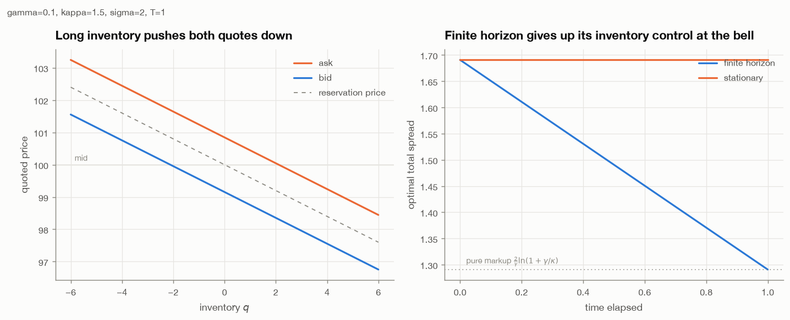
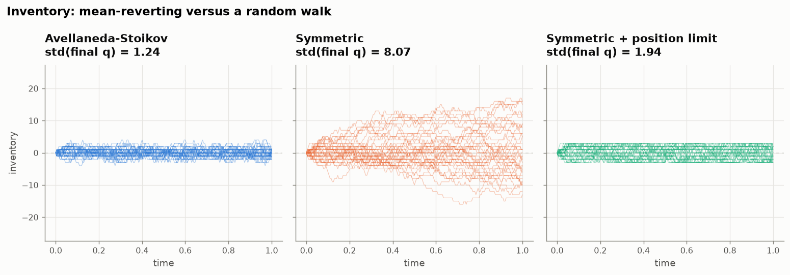
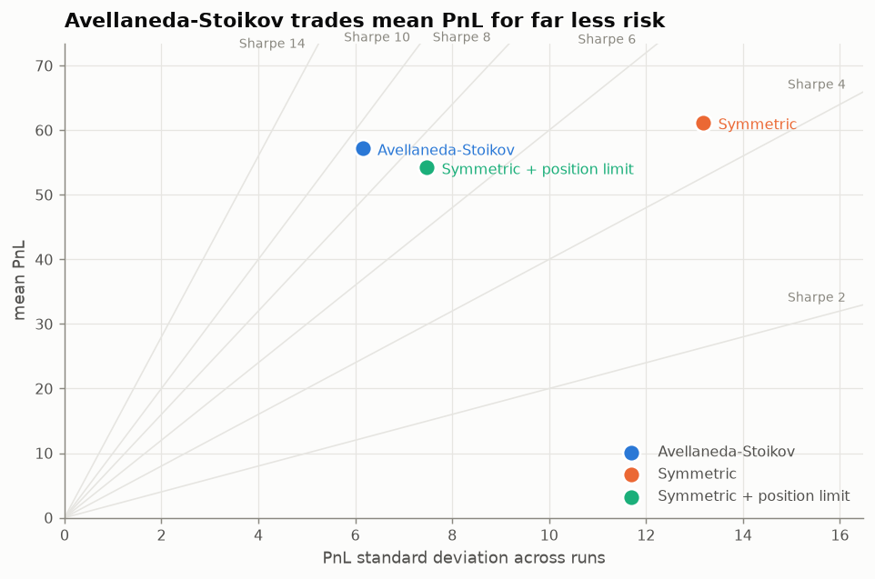
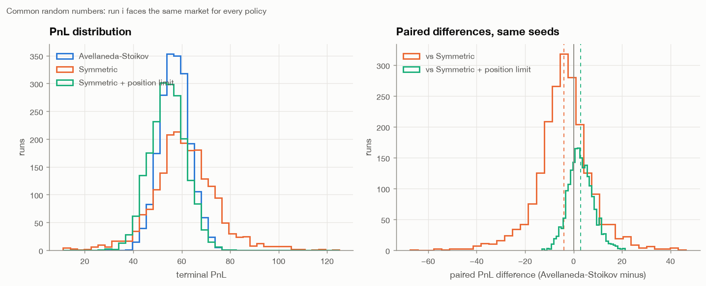
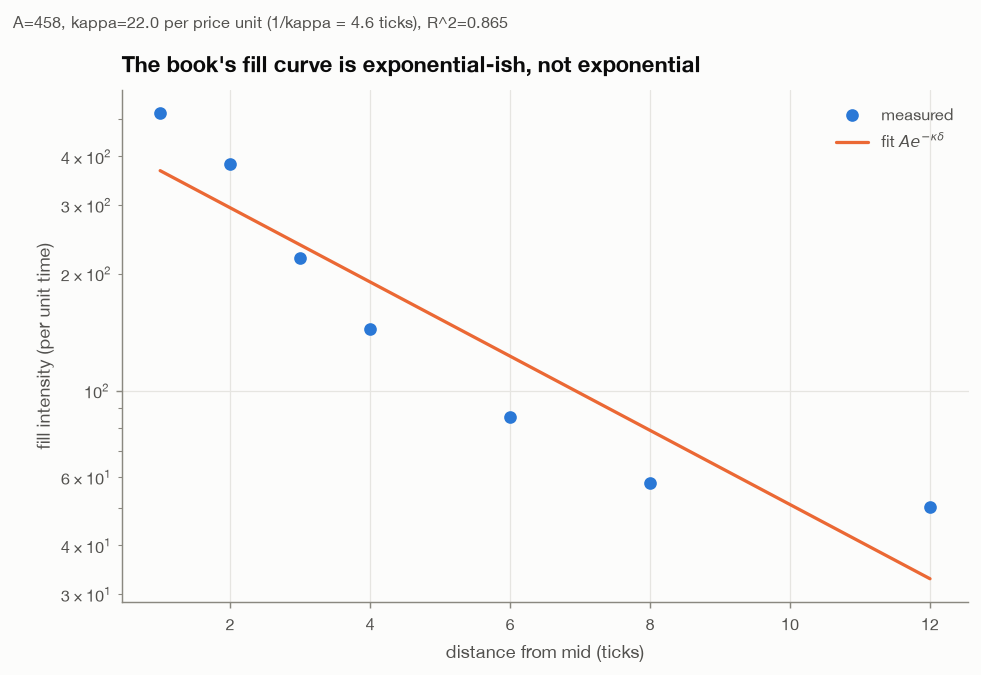
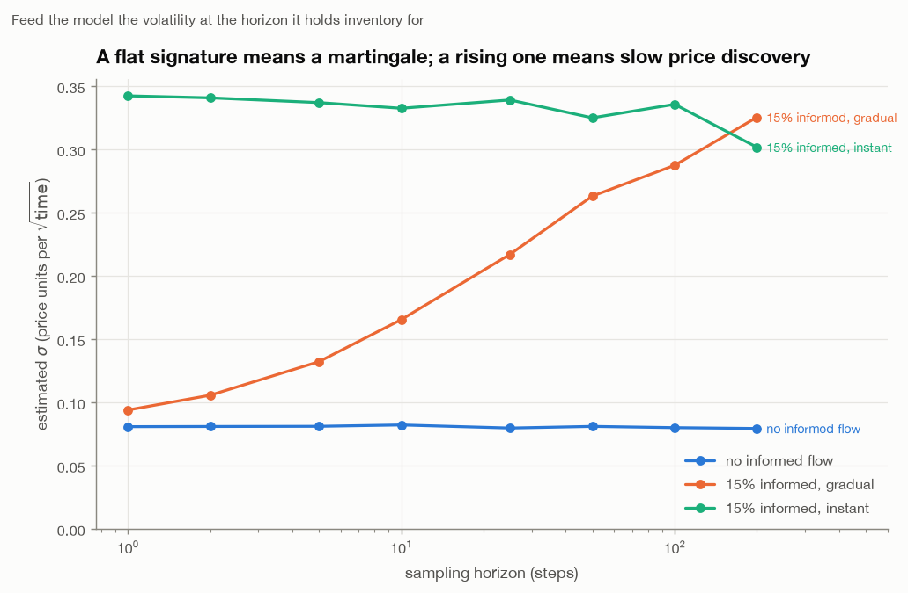
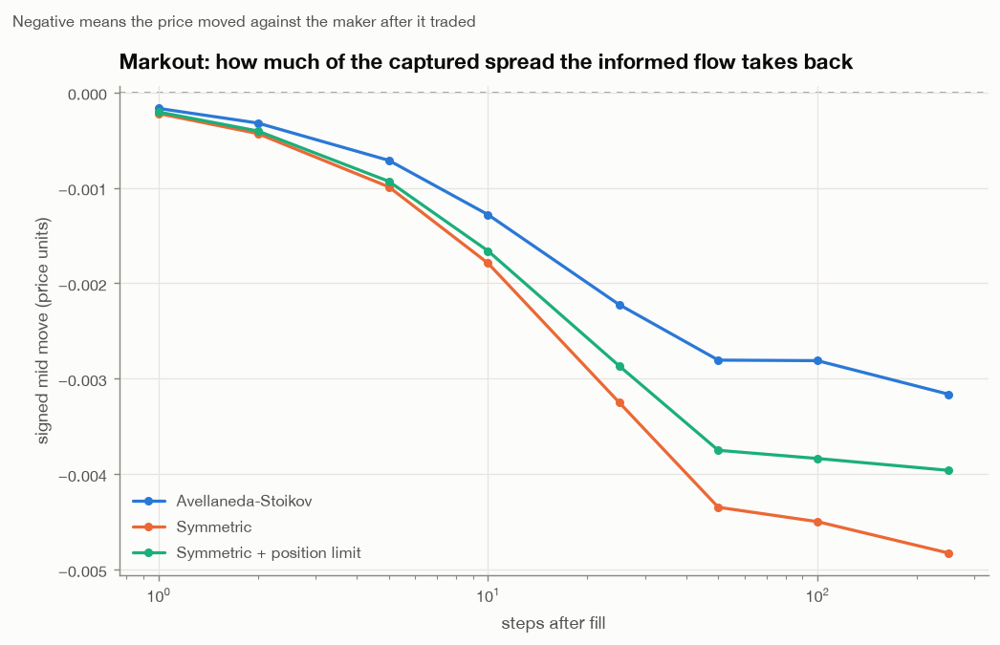
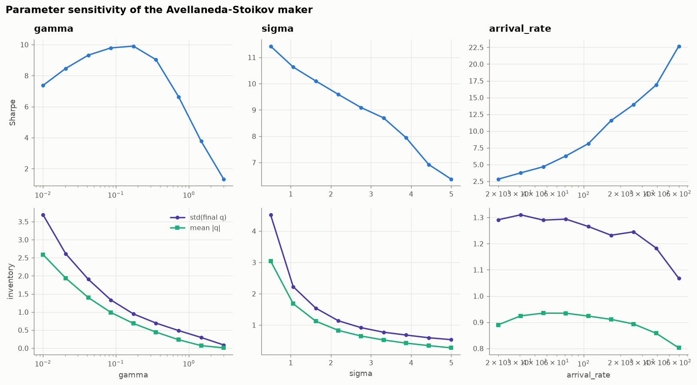
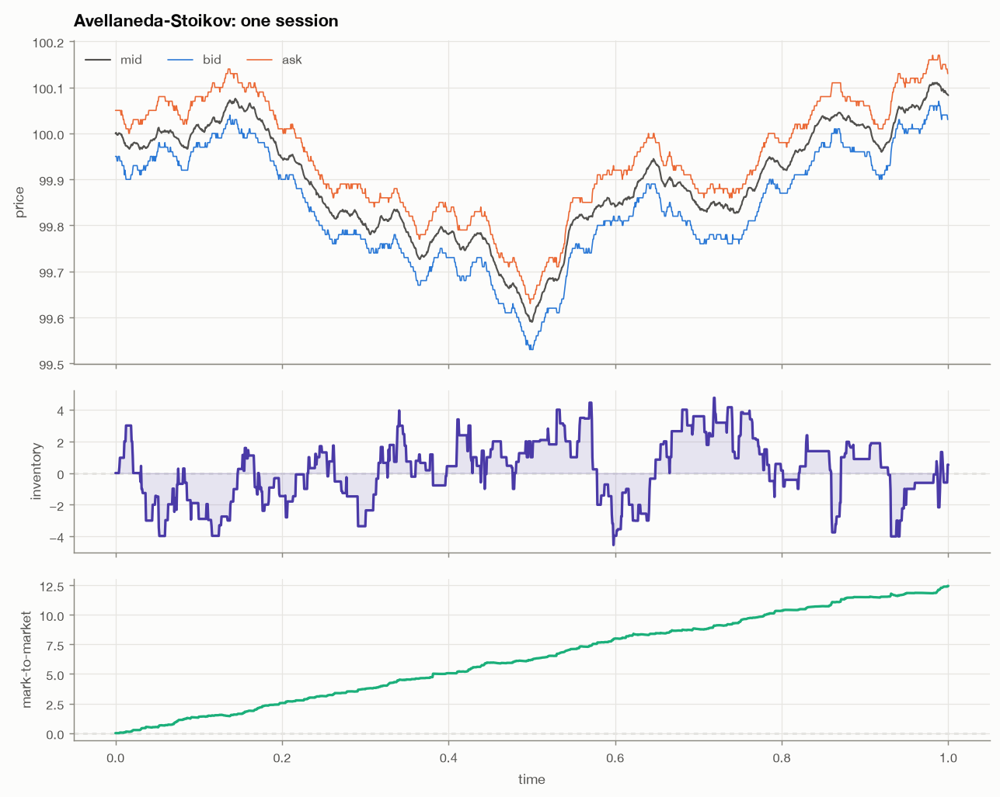

# Market Making Simulator

**A limit order book from scratch, the Avellaneda-Stoikov optimal quoting model, and an honest measurement of what inventory control is actually worth.**

The published Table 1 of Avellaneda & Stoikov (2008) is reproduced to two decimal places. Then the same strategies are run in a full matching engine with queue priority and informed traders, to see how much of the theory survives.

---

## The 60-second version

| | Result |
|---|---|
| **Order book** | Price-time priority matching engine, O(1) cancels, self-trade prevention. 23 tests on the invariants that flatter a strategy when broken. |
| **Validation** | Avellaneda & Stoikov Table 1 reproduced with their own discretisation: profit **64.98** vs published 65.0, std **6.62** vs 6.6; symmetric **68.44** vs 68.4, std **13.70** vs 13.4. Analytic average spread **1.4908** vs 1.49. |
| **Idealised world** | A-S Sharpe **9.29** vs symmetric **4.64** — at an identical average spread. Inventory std 1.24 vs 8.07. |
| **Full order book** | A-S Sharpe **11.7** vs symmetric **2.8**, at statistically identical PnL (p = 0.53). Max position 10.7 vs 53.3. |
| **Fair benchmark** | Against a naive maker *with a hard position limit*, A-S still wins: Sharpe 11.7 vs 6.9 and **+1.35 PnL per run, t = 11.0**. |
| **Adverse selection** | With 30% informed flow, the symmetric maker's Sharpe collapses from 12.2 to **2.0**. A-S goes 12.9 → **12.0**. |
| **Honest finding** | The published finite-horizon model **throws away its inventory control at the bell**: inventory std grows 1.06 → 2.90 over the session. The time-homogeneous variant stays flat at ~1.2. |

```bash
pip install -r requirements.txt
python scripts/run_analysis.py      # ~12 min; writes figures/ and results/
pytest --cov=src/mmsim              # 124 tests, 98% coverage
```

---

## 1. The problem

A market maker quotes a bid and an ask and earns the spread when both get hit. The difficulty is everything in between:

- Fills arrive **one side at a time**, so the maker accumulates inventory it did not want.
- That inventory is a directional position, and its risk grows with volatility and holding time.
- Some of the flow hitting you **knows something you do not**, so the mid moves against you right after you trade.

Avellaneda-Stoikov is the canonical answer to the first two. This repo implements it, validates it against the paper, then asks what happens once fills depend on queue position and a fraction of the flow is informed.

---

## 2. The maths

### Setup

The efficient mid is an arithmetic Brownian motion $dS_t = \sigma\,dW_t$. The maker quotes $\delta^b$ below and $\delta^a$ above. Fills arrive as Poisson processes whose intensity falls exponentially with distance:

$$\lambda(\delta) = A e^{-\kappa\delta}.$$

The maker holds inventory $q$ and cash $X$ and maximises exponential utility $\mathbb{E}\big[-e^{-\gamma(X_T + q_T S_T)}\big]$.

### Solution

Solving the HJB equation and expanding to first order in inventory gives the **reservation price**

$$r(s, q, t) = s - q\gamma\sigma^2(T-t)$$

and the **optimal total spread**

$$\delta^a + \delta^b = \gamma\sigma^2(T-t) + \frac{2}{\gamma}\ln\!\left(1 + \frac{\gamma}{\kappa}\right),$$

with the quotes placed symmetrically around $r$, not around $s$:

$$\delta^a = \tfrac12(\delta^a+\delta^b) - q\gamma\sigma^2(T-t), \qquad \delta^b = \tfrac12(\delta^a+\delta^b) + q\gamma\sigma^2(T-t).$$

### The one idea

Everything is in the skew term $q\gamma\sigma^2(T-t)$. A maker who is long shifts **both** quotes down — keener to sell, more reluctant to buy — so inventory mean-reverts without the maker ever crossing the spread. The width never changes; only the centre moves.



A quirk worth knowing: the markup term $\frac{2}{\gamma}\ln(1+\gamma/\kappa)$ is *decreasing* in $\gamma$, approaching $2/\kappa$ from below. A more risk-averse maker charges a smaller monopolistic markup — it prefers a likelier small gain — but the linear inventory term dominates, so the total spread still widens.

---

## 3. Validating against the paper

At the paper's parameters ($\gamma=0.1$, $\kappa=1.5$, $A=140$, $\sigma=2$, $T=1$), the analytic average spread is

$$\tfrac12\gamma\sigma^2 T + \tfrac{2}{\gamma}\ln(1+\gamma/\kappa) = 0.2 + 1.2908 = \mathbf{1.4908},$$

against the paper's reported 1.49. That single number pins both terms of the formula and their relative weight against an independent source.

2,000 simulated sessions, using the paper's own first-order fill discretisation:

| Strategy | Spread | Profit | (paper) | Std(profit) | (paper) | Std(final $q$) | (paper) |
|---|---|---|---|---|---|---|---|
| Inventory (A-S) | 1.49 | **64.98** | 65.0 | **6.62** | 6.6 | 3.01 | *2.0* |
| Symmetric | 1.49 | **68.44** | 68.4 | **13.70** | 13.4 | **8.34** | 8.4 |

Six of the seven entries land within Monte Carlo error. The exception is `Std(final q)` for the inventory strategy: 3.01 against 2.0. That the *symmetric* strategy's inventory spread matches (8.34 vs 8.4) argues the quoting logic is right and something about the paper's measurement of that one number differs; I could not identify what, and it is reported rather than tuned away.

**The paper's discretisation overstates fills by ~13%.** It uses $\lambda\Delta t$ where the true probability of at least one arrival is $1-e^{-\lambda\Delta t}$. At $\lambda\approx45$, $\Delta t=0.005$ the gap is 10%, and it accounts for the entire difference between reproducing the paper (65.0) and the exact simulation (57.4). The exact form is the default here; `fill_model="linear"` exists to reproduce the published numbers.

---

## 4. What the model actually buys you

Every strategy quotes the **same average spread**, so the comparison measures inventory management and not how wide someone chose to quote. The benchmark set is:

1. **Avellaneda-Stoikov** — skews around the reservation price.
2. **Symmetric** — fixed half-spread around the mid, no inventory control at all.
3. **Symmetric + position limit** — the realistic naive strategy: stop quoting a side at a hard limit.

The third exists because beating a maker with *no* inventory control is too easy a win.



2,000 sessions in the idealised model, with common random numbers so every policy faces the same price path:

| Policy | Mean PnL | Std PnL | **Sharpe** | Mean \|q\| | Std final q | Max \|q\| | Trades | Max DD |
|---|---|---|---|---|---|---|---|---|
| Avellaneda-Stoikov | 57.18 | 6.16 | **9.29** | 0.92 | 1.24 | 6.0 | 85.9 | 0.99 |
| Symmetric | 61.17 | 13.19 | 4.64 | 4.29 | 8.07 | 29.0 | 82.0 | 5.72 |
| Symmetric + position limit | 54.22 | 7.48 | 7.25 | 1.57 | 1.94 | 3.0 | 72.7 | 1.84 |



**A-S makes less money than naive symmetric quoting**, by 3.99 per session (paired $t = -15.6$). That is not a defect, it is the trade: it gives up the option value of running a big position in exchange for halving PnL volatility, and doubles the Sharpe doing so. Being explicit about this is more useful than a chart showing only the ratio.

Against the *fair* benchmark it wins on both axes: **+2.96 PnL per session** ($t = 25.9$) **and** a higher Sharpe. The hard limit captures roughly three quarters of the risk benefit; the continuous skew supplies the rest while trading 18% more.



---

## 5. The same strategies in a real order book

The idealised engine fills the maker whenever a fill "arrives", regardless of who else is quoting. That assumption flatters every market-making backtest ever written, so the second engine removes it: quotes join a real FIFO queue, noise traders add and cancel liquidity, market orders walk the book, and 15% of them are informed.

### Parameters are estimated, not chosen

$\kappa$ is measured in **inverse price units**. Copying the paper's $\kappa=1.5$ onto a book with a 2-tick spread produces quotes 115 ticks wide and a maker that never trades — which is exactly what the first version did. So $\sigma$, $A$ and $\kappa$ are estimated from the simulated market by probing it, the way a desk estimates them from its own fill logs.



The fit gives $A = 458$, $\kappa = 21.96$ per price unit ($1/\kappa = 4.55$ ticks), with $R^2 = 0.865$ on the log-linear regression. **Not 1.0** — the tail is fatter than exponential, because market-order sizes are power-law and the occasional large sweep reaches deep levels far more often than $e^{-\kappa\delta}$ predicts. The model's core assumption holds approximately, and the number says how approximately.

### Volatility must be measured at the right horizon



This chart caught a real bug. Informed impact is released gradually, so the efficient price is **positively autocorrelated** at short horizons and a one-step volatility estimate understates what a maker faces by about 4x ($\sigma = 0.094$ at one step against $0.33$ at the horizon the maker actually holds inventory). With no informed flow the signature is flat — a pure martingale. With instantaneous impact it is flat again at the higher level. Only *slow price discovery* tilts it.

### Results

200 sessions of 3,000 steps each:

| Policy | Mean PnL | Std PnL | **Sharpe** | Mean \|q\| | Max \|q\| | Trades | Max DD |
|---|---|---|---|---|---|---|---|
| Avellaneda-Stoikov | 12.66 | 1.08 | **11.7** | 1.49 | 10.7 | 262 | 0.18 |
| Symmetric | 12.47 | 4.44 | 2.8 | 8.69 | 53.3 | 241 | 2.26 |
| Symmetric + position limit | 11.31 | 1.65 | 6.9 | 3.40 | 8.6 | 220 | 0.59 |

In the book world A-S's PnL is **statistically indistinguishable** from symmetric quoting ($p = 0.53$) while its Sharpe is 4.2x higher and its worst drawdown 12x smaller. It still beats the position-limit benchmark on PnL by 1.35 per session ($t = 11.0$).

PnL decomposes exactly into spread capture and inventory mark-to-market (reconciliation error 0.00000 in every run):

| Policy | Spread capture | Inventory PnL | Total |
|---|---|---|---|
| Avellaneda-Stoikov | 13.25 | −0.59 | 12.66 |
| Symmetric | 12.89 | −0.42 | 12.47 |
| Symmetric + position limit | 11.77 | −0.46 | 11.31 |

---

## 6. Adverse selection

Informed traders permanently move the efficient price in the direction they trade. With informed fraction $p$ and impact $J$, the expected cost per fill is $pJ$ — a maker quoting inside that loses money no matter how well it manages inventory.



The markout curve builds over the ~20-step price-discovery window and plateaus, exactly as a desk's does. **The A-S maker is less adversely selected than the symmetric one** (−0.0028 vs −0.0045 at 100 steps), which is not obvious in advance: by skewing away from inventory it avoids being repeatedly filled on the same side by informed flow.

| Informed fraction | Expected cost (ticks) | A-S Sharpe | Symmetric Sharpe |
|---|---|---|---|
| 0% | 0.00 | 12.9 | 12.2 |
| 10% | 0.20 | 10.7 | 3.6 |
| 20% | 0.40 | 11.9 | 2.8 |
| 30% | 0.60 | 12.0 | 2.0 |

**With no informed flow the two strategies are nearly tied.** Inventory control only pays once inventory is genuinely risky, and it is informed flow that makes it so: it is what drives $\sigma$ up, which is what drives the skew. The model's entire advantage is conditional on the market being dangerous.

---

## 7. Parameter sensitivity



**Risk aversion $\gamma$ has an interior optimum.** Sharpe peaks near $\gamma \approx 0.17$ at 9.91, and falls off on both sides: too little and inventory risk dominates; too much and the quotes are so wide the maker stops trading (at $\gamma = 3$ it makes 3.5 trades a session and 1.3 in PnL). Nothing in the model says this — it emerges because $\gamma$ trades inventory risk against fill rate.

**Volatility $\sigma$ hurts monotonically**: Sharpe falls 11.4 → 6.4 as $\sigma$ goes 0.5 → 5.0. The maker widens in response (spread 1.30 → 2.54) and trades 39% less.

**Arrival intensity $A$ helps monotonically**: Sharpe rises 2.8 → 22.7 as $A$ goes 20 → 600. More flow means more independent spread captures and better diversification. This is also why the *level* of these Sharpe ratios is not comparable to a real desk's — it is set by how much flow the simulation happens to generate.



---

## 8. Limitations

- **One market maker, no competition.** Every other order is noise. The monopolistic markup term is doing a lot of work; it would shrink sharply against a second strategic maker. This is the most important missing piece.
- **Informed traders are exogenous.** They do not condition on the book, so the maker cannot reduce its adverse selection by quoting wider — one of the main levers a real desk has.
- **No latency.** Cancels never race fills. In practice that race *is* adverse selection for a passive maker.
- **Fixed size.** How much to quote is as important as where, and A-S says nothing about it.
- **Sharpe is per simulated session.** Only the ratio between strategies is meaningful; the level is an artefact of the arrival rate.
- **The fill curve is not exponential** ($R^2 = 0.865$), so the "optimal" quotes are optimal for a market slightly different from the one they run in.
- **One asset.** No cross-asset hedging or correlated inventory.

Full list, including six defects found and fixed during development, in [REVIEW.md](REVIEW.md).

---

## 9. Repository layout

```
src/mmsim/
  types.py               Side/Order/Trade, integer tick prices
  book.py                Price-time priority matching engine
  flow.py                Poisson flow, Pareto sizes, informed traders with gradual impact
  avellaneda_stoikov.py  Reservation price, optimal spread, finite and stationary horizon
  strategies.py          The three quoting policies, matched on average spread
  engine.py              The idealised A-S world and the full order-book world
  calibration.py         Estimate sigma, A, kappa from the book; volatility signature
  metrics.py             PnL decomposition, markout, cross-run Sharpe
  experiments.py         Common random numbers, paired tests, sensitivity sweeps
  style.py / plotting.py One validated palette; every figure in this README
scripts/run_analysis.py  The full study
tests/                   124 tests, 98% statement + branch coverage
```

## 10. Running it

```bash
python -m venv .venv && source .venv/bin/activate
pip install -r requirements.txt

python scripts/run_analysis.py                       # full study, ~12 minutes
python scripts/run_analysis.py --runs-book 40        # a quick version

pytest -q
pytest -q --cov=src/mmsim --cov-report=term-missing
ruff check src tests scripts && mypy src scripts
```

Everything is seeded; the numbers above reproduce exactly.
