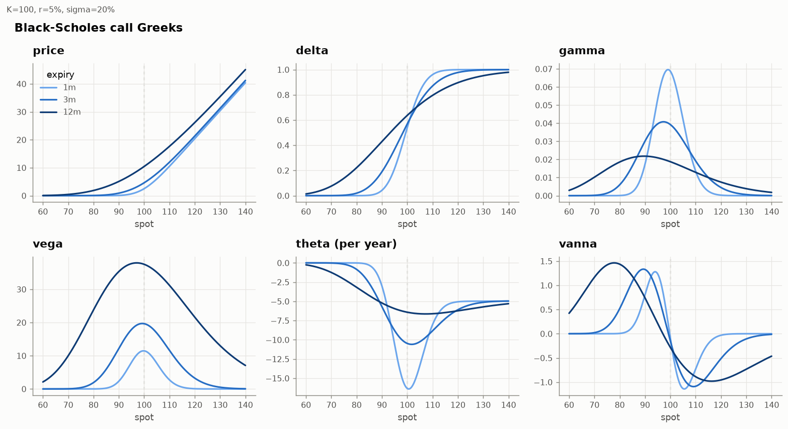
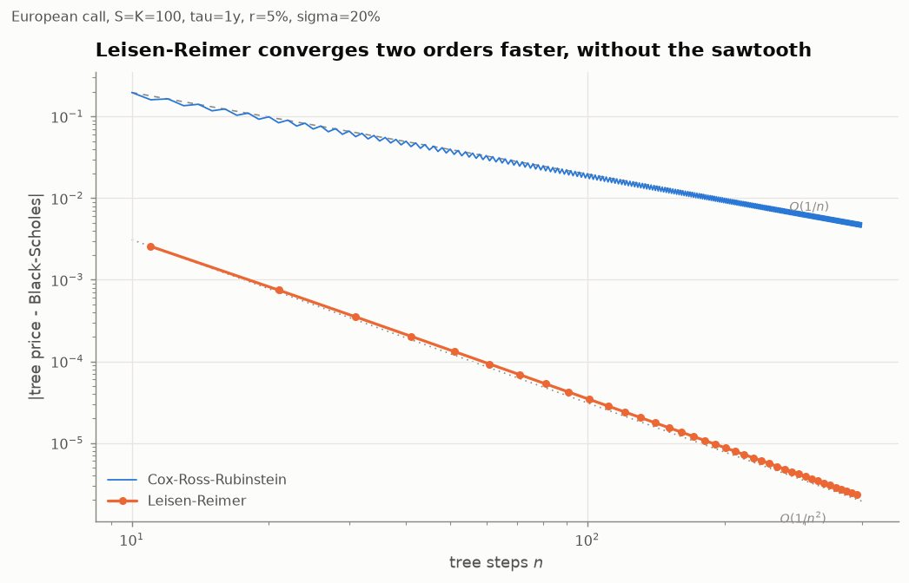
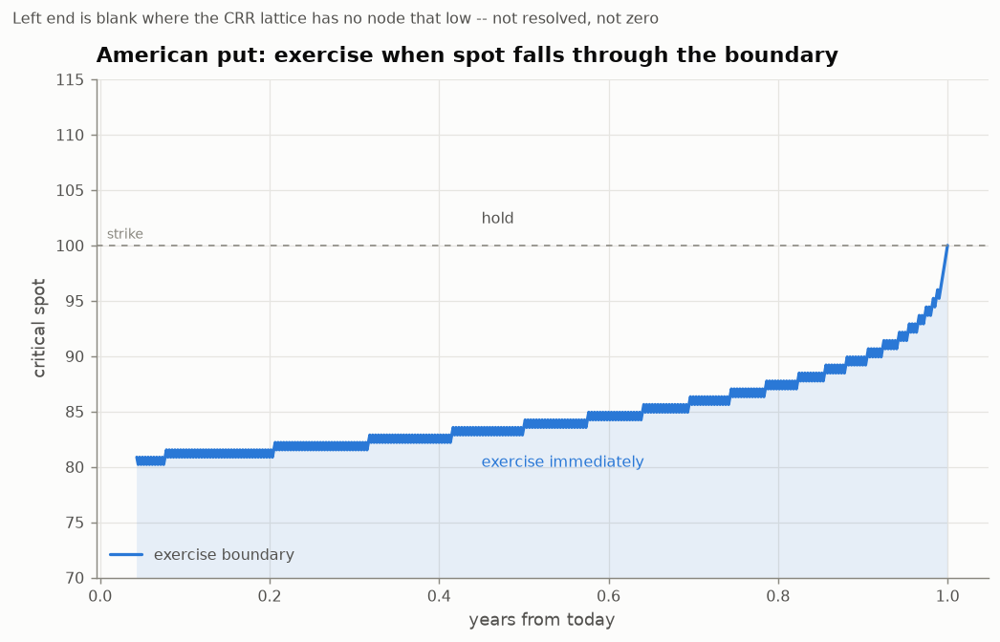
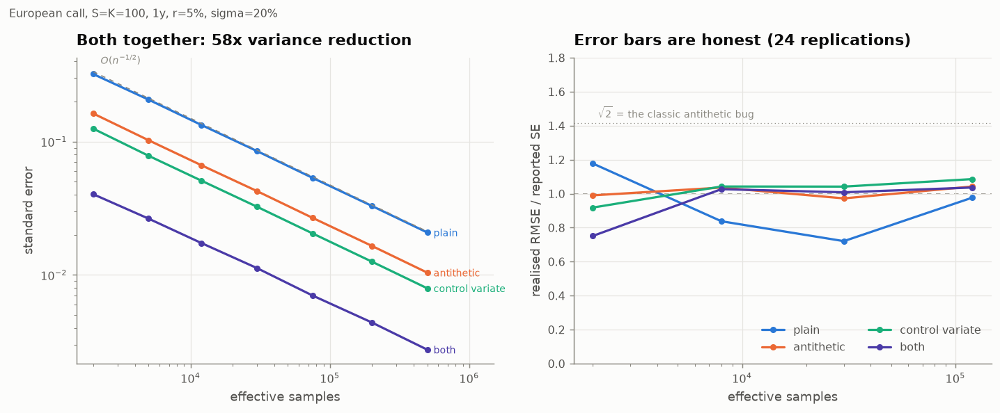
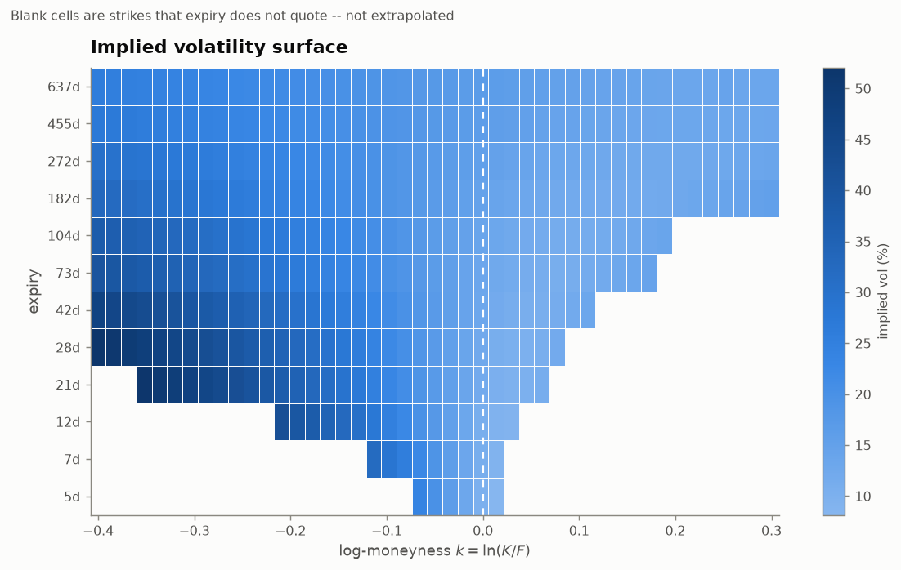
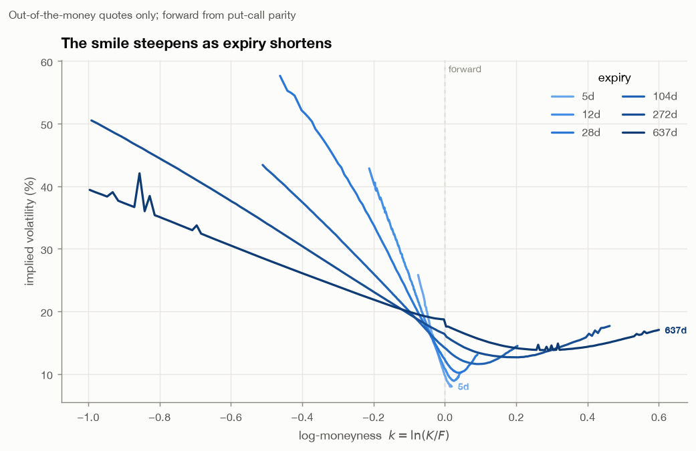
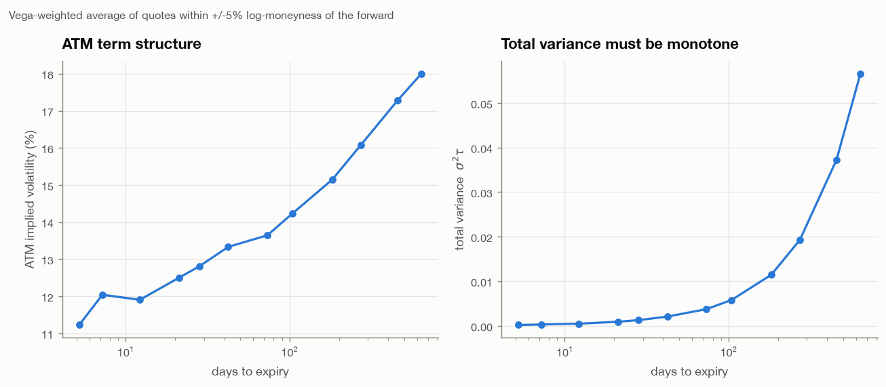
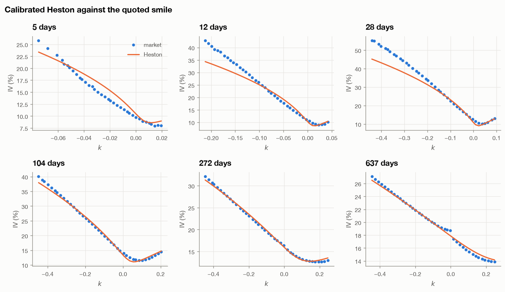
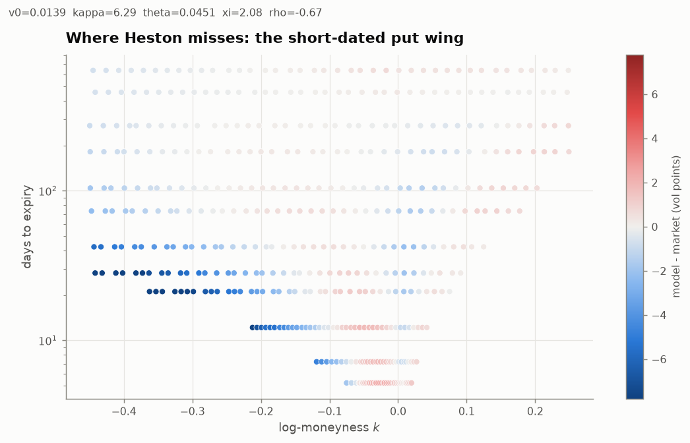

# Options Pricing Engine

**Black-Scholes, binomial trees, Monte Carlo and Heston — built from scratch, validated against each other, and calibrated to a live SPY option chain.**

Every pricer is cross-checked against an independently derived one, every chart is produced by a script you can rerun offline, and the results section says what did *not* work as well as what did.

---

## The 60-second version

| | Result |
|---|---|
| **Analytic** | Black-Scholes price + 10 Greeks, fully vectorised. Greeks verified against central finite differences of the price function. |
| **Lattice** | CRR / Jarrow-Rudd / Leisen-Reimer, European + American. LR at **101 steps** beats CRR at **2,001 steps** (3.4e-5 vs 8.8e-4 error). |
| **Monte Carlo** | Antithetic + control variates: **57x variance reduction** on a European call, **576x** on an arithmetic Asian (geometric-Asian control, ρ = 0.9991). Error bars verified calibrated over 40 replications. |
| **Implied vol** | Safeguarded Newton (`rtsafe`). Converges in ≤16 iterations to **1e-11** of vol even where vega is 1e-6. |
| **Heston** | Characteristic function ("little trap" branch), two independent quadratures agreeing to 1e-8, cross-checked against a full-truncation Euler Monte Carlo. |
| **Real data** | 4,469 SPY quotes → 2,012-point surface across 12 expiries. Forward from put-call parity, 0 calendar-arbitrage violations. |
| **Calibration** | Heston fits the SPY surface to **2.51 vol points** RMSE with 5 parameters, against **10.61** for a Black-Scholes model with one free volatility *per expiry* (12 parameters). Out-of-sample on held-out strikes: **2.38**. |
| **Honest limitation** | That 2.51 is **1.09 vol points in the body** and **5.92 in the short-dated put wing**. Heston cannot generate enough short-dated skew. You need jumps. |

```bash
pip install -r requirements.txt
python scripts/run_analysis.py --ticker SPY     # ~3 min; caches to data/, writes figures/ and results/
pytest --cov=src/optpricing                     # 373 tests, 99% coverage
```

---

## 1. The problem

An option's price is not an opinion, it is a number implied by no-arbitrage plus a model of how the underlying moves. This repo implements that chain end to end:

1. **Price** a vanilla under a given model (three ways, so they can check each other).
2. **Invert** the pricing map: given a market quote, what volatility does it imply?
3. **Build a surface** from a real, messy option chain — which is mostly a data-cleaning and forward-curve problem, not a maths problem.
4. **Fit a model** that can actually reproduce that surface, and be honest about where it cannot.

---

## 2. The maths

### Black-Scholes-Merton

Under the risk-neutral measure the spot is a geometric Brownian motion,

$$dS_t = (r-q)S_t\,dt + \sigma S_t\,dW_t,$$

giving, with $\tau = T-t$,

$$d_1 = \frac{\ln(S/K) + (r - q + \tfrac{1}{2}\sigma^2)\tau}{\sigma\sqrt{\tau}}, \qquad d_2 = d_1 - \sigma\sqrt{\tau},$$

$$C = S e^{-q\tau} N(d_1) - K e^{-r\tau} N(d_2), \qquad P = K e^{-r\tau} N(-d_2) - S e^{-q\tau} N(-d_1).$$

Ten Greeks are implemented analytically: Δ, Γ, vega, Θ, ρ, vanna $\partial^2V/\partial S\partial\sigma$, volga $\partial^2V/\partial\sigma^2$, charm $\partial\Delta/\partial t$, and dual delta $\partial V/\partial K$ — whose negative is the risk-neutral CDF of $S_T$, and therefore the thing a surface must keep monotone for the implied density to stay non-negative.



### Binomial lattices

Over one step of length $\Delta t = \tau/n$ the spot moves to $Su$ or $Sd$, with the risk-neutral probability that makes the discounted spot a martingale:

$$p = \frac{e^{(r-q)\Delta t} - d}{u - d}.$$

Three parameterisations are implemented. **Cox-Ross-Rubinstein** uses $u = e^{\sigma\sqrt{\Delta t}}$, $d = 1/u$ and converges as $O(1/n)$ with a sawtooth — the strike drifts between terminal nodes as $n$ changes parity. **Leisen-Reimer** inverts the Peizer-Pratt normal approximation so the tree is centred on the strike; it converges $O(1/n^2)$ and the sawtooth disappears.

American exercise is $\max(\text{continuation}, \text{intrinsic})$ at every node.



The lattice also gives the **early-exercise boundary** — the critical spot below which an American put should be exercised immediately:



### Monte Carlo and variance reduction

European payoffs are priced from exact one-shot lognormal draws, so there is no discretisation bias and the entire error is statistical.

**Antithetic variates** price each draw at $Z$ and $-Z$ and average the pair. A vanilla payoff is monotone in $Z$, so the legs are negatively correlated.

**Control variates** use a correlated variable $X$ with known mean:

$$\hat\theta = \bar Y - \beta(\bar X - \mathbb{E}[X]), \qquad \beta^* = \frac{\operatorname{Cov}(Y, X)}{\operatorname{Var}(X)},$$

reducing variance by $1-\rho^2_{XY}$. For vanillas the control is $S_T$ itself; for arithmetic Asians it is the **geometric** Asian, whose discrete-fixing price is closed form:

$$\sigma_G^2 = \frac{\sigma^2\tau(m+1)(2m+1)}{6m^2}, \qquad \bar t = \frac{\tau(m+1)}{2m}.$$



The right-hand panel is the one that matters for trusting the numbers: it plots realised RMSE over 24 independent runs divided by the standard error those runs *reported*. It sits at 1. The dotted line at $\sqrt{2}$ marks where the classic antithetic bug lands — counting the $Z$ and $-Z$ legs as independent draws leaves the price correct and only the error bar wrong, which is exactly the kind of mistake that survives casual testing.

### Implied volatility

Black-Scholes is strictly increasing in $\sigma$ between the no-arbitrage bounds, so the inverse exists and is unique. Newton-Raphson with analytic vega converges quadratically but is **not globally safe** — vega collapses for deep-ITM/OTM and short-dated strikes, which is where a real chain has most of its rows. The solver is the Numerical-Recipes `rtsafe` hybrid, vectorised: a bracket is maintained at all times, a Newton step is taken when it lands inside the bracket and is at least halving the interval, and bisection is taken otherwise.

### Heston

$$dS_t = (r-q)S_t\,dt + \sqrt{v_t}S_t\,dW^S_t, \qquad dv_t = \kappa(\theta - v_t)\,dt + \xi\sqrt{v_t}\,dW^v_t, \qquad d\langle W^S,W^v\rangle_t = \rho\,dt.$$

No closed-form price, but the characteristic function of $\ln S_T$ is known, so with $F = S_0e^{(r-q)\tau}$, $k = \ln(K/F)$ and $\psi$ the characteristic function of $\ln(S_T/F)$:

$$P_j = \frac12 + \frac1\pi\int_0^\infty \Re\!\left[\frac{e^{-iuk}\,\psi(u - i\,\mathbb{1}_{j=1})}{iu}\right]du, \qquad C = S_0e^{-q\tau}P_1 - Ke^{-r\tau}P_2,$$

$$d = \sqrt{(\rho\xi iu - \kappa)^2 + \xi^2(iu + u^2)}, \quad g = \frac{\kappa - \rho\xi iu - d}{\kappa - \rho\xi iu + d},$$

$$\psi(u) = \exp\!\left(\frac{\kappa\theta}{\xi^2}\Big[(\kappa-\rho\xi iu-d)\tau - 2\ln\tfrac{1-ge^{-d\tau}}{1-g}\Big] + \frac{\kappa-\rho\xi iu-d}{\xi^2}\frac{1-e^{-d\tau}}{1-ge^{-d\tau}}\,v_0\right).$$

---

## 3. Design decisions worth defending

Full log in [DECISIONS.md](DECISIONS.md). The five that changed results:

### The discount factor comes from the rates market; only the forward comes from parity

Put-call parity is model-free: $C(K) - P(K) = D(F-K)$. It is tempting to regress $C-P$ on $K$ and read off **both** $D$ (minus the slope) and $F$ (intercept over $D$). That fit is badly conditioned. On live SPY quotes it returns:

| $\tau$ | implied rate, joint regression | $R^2$ |
|---|---|---|
| 0.014 | **+41.7%** | 0.9998 |
| 0.058 | **−33.3%** | 0.9998 |
| 0.116 | **−19.9%** | 0.9993 |
| 1.746 | +1.0% | 0.9996 |

The line fits beautifully and its slope is meaningless — a 1% error in the slope is a 1% error in $D$, which at $\tau = 0.06$ is a **17 percentage point** error in $r$. The default therefore takes $D$ from the Treasury curve and solves parity for $F$ strike by strike, taking the median. Both methods are kept so the failure is visible rather than asserted, and both are covered by tests.

### The butterfly arbitrage test is spread-aware

SPY lists \$1 strikes near the money, where a one-lot butterfly is worth about as much as the \$0.01 quote tick. A zero-tolerance convexity test on mid prices flags **26%** of strike triples. Netting off the bid-ask cost of all three legs — i.e. asking whether the butterfly is actually *buyable* for a negative amount — leaves **2.9%**. Both numbers are reported, because the gap between them is the interesting one.

### The Monte Carlo control coefficient is fitted after the antithetic fold, not before

This was a real bug in the first version. Fitting $\beta$ on the raw $Z$/$-Z$ legs minimises the variance of an estimator that is not the one being reported. Fixing it changed the combined antithetic+control result from *worse than the control alone* (SE 0.0175) to **57x better than plain Monte Carlo** (SE 0.0043).

### Implied vol converges in volatility space, not price space

Stopping at $|V_{BS}(\sigma) - V_{mkt}| < 10^{-10}$ sounds strict and is not: a five-day 10%-OTM call has vega around $10^{-6}$, so that price tolerance leaves $10^{-4}$ of *volatility* error. Adding a bracket-width criterion costs a handful of bisection steps and improved the worst-case accuracy on the test suite from **5e-5 to 1.7e-11**.

### The Heston benchmark is one vol per expiry, not one vol overall

A single global Black-Scholes volatility is a straw man. One volatility per expiry already reproduces the entire at-the-money term structure exactly and has *more* free parameters than Heston (12 vs 5). Whatever error it leaves is, by construction, the smile — the only thing a stochastic volatility model can buy you.

---

## 4. Results

### Pricers agree with each other

European call, $S = K = 100$, $\tau = 1$y, $r = 5\%$, $\sigma = 20\%$. Black-Scholes: **10.45058357**.

| Method | Price | Error |
|---|---|---|
| Black-Scholes (analytic) | 10.45058357 | — |
| CRR binomial, 2,001 steps | 10.45145952 | +8.8e-04 |
| Leisen-Reimer, 101 steps | 10.45054934 | −3.4e-05 |
| Monte Carlo, antithetic + control, 200k | 10.45010447 | −4.8e-04 (SE 4.3e-03) |

Variance reduction at matched effective sample counts:

| Scheme | Standard error | Variance reduction |
|---|---|---|
| plain | 0.03290 | 1.0× |
| antithetic | 0.01645 | 4.0× |
| control variate ($S_T$) | 0.01256 | 6.9× |
| **both** | **0.00434** | **57.4×** |
| arithmetic Asian, geometric control | 0.00055 vs 0.01326 | **576×** (ρ = 0.9991) |

The American put on the same parameters is worth **6.0900**, a **0.5173** early-exercise premium over the European. With no dividends, the American *call* matches the European to 1e-10 — as it must, since early exercise is never optimal.

Heston is validated three ways: the Black-Scholes limit ($\xi \to 0$) to **1e-9**, Gil-Pelaez against Lewis' single-integral form to **1e-8**, and against a full-truncation Euler Monte Carlo to within one standard error across strikes.

### The SPY volatility surface

Snapshot: **SPY, 2026-09-18 11:09 ET, spot 759.87**. 4,469 raw quotes → 3,880 after cleaning (86.8% kept) → **2,012 surface points** across 12 expiries.



The blank cells are real: short expiries simply do not quote wide strikes, and the pipeline does not extrapolate into them. The same data as a conventional 3-D surface is in [`figures/surface_3d.png`](figures/surface_3d.png) — spaced by $\sqrt{\text{days}}$, because half of SPY's listed expiries fall inside three months and a linear axis crushes all the structure into the front edge.



Textbook equity behaviour: a steep put skew that flattens with maturity, and a call wing that turns back up past roughly $k = +0.07$. At-the-money volatility rises monotonically from **11.2% at 5 days to 18.0% at 1.7 years**.



Arbitrage checks on the fitted surface:

```
Calendar-spread violations : 0/228 (0.0%)
Butterfly, zero tolerance  : 517/1988 (26.0%)   <- dominated by the $0.01 quote tick
Butterfly, net of spread   :  57/1988 ( 2.9%)
```

### Heston calibration

Calibrated on 468 thinned quotes. All four multi-start seeds converge to the same optimum (RMSE spread 2.5063–2.5063 vol points), which is worth stating because Heston objectives are genuinely multimodal.

$$v_0 = 0.0130, \quad \kappa = 6.42, \quad \theta = 0.0473, \quad \xi = 1.96, \quad \rho = -0.680$$

| Model | Free parameters | RMSE (vol pts) | MAE | Max |
|---|---|---|---|---|
| Black-Scholes, one vol | 1 | 11.23 | 8.63 | 35.44 |
| Black-Scholes, one vol per expiry | 12 | 10.61 | 8.25 | 32.08 |
| **Heston** | **5** | **2.51** | **1.37** | **10.91** |



**It is not overfitting.** Fitting on alternate strikes within each expiry and scoring on
the rest:

| Model | In-sample RMSE | Out-of-sample RMSE | Ratio |
|---|---|---|---|
| Black-Scholes, one vol | 11.43 | 10.95 | 0.96 |
| Black-Scholes, one vol per expiry | 10.80 | 10.31 | 0.96 |
| **Heston** | **2.55** | **2.38** | **0.93** |

All three degrade by nothing — with 5 parameters against 234 training quotes there is
nothing to overfit — and Heston's advantage survives intact. Strikes are interleaved
*within* each expiry rather than holding out whole expiries, because the latter tests
extrapolation in maturity, which is a different and much harder question.

**The parameters are estimated more precisely than they are identified.** Asymptotic
standard errors from the Jacobian at the optimum:

| | v0 | κ | θ | ξ | ρ |
|---|---|---|---|---|---|
| estimate | 0.0130 | 6.416 | 0.0473 | 1.961 | −0.680 |
| std. error | 0.0003 | 0.246 | 0.0004 | 0.053 | 0.006 |
| relative | 2.4% | 3.8% | 0.8% | 2.7% | 0.9% |

Those look tight, and they overstate the case: the calculation assumes independent
residuals, and adjacent strikes on an option chain are strongly dependent, so the true
uncertainty is larger. The more useful output is the correlation matrix, where
**corr(κ, ξ) = +0.83** and **corr(κ, θ) = −0.79**. Raising the mean-reversion speed and
the vol-of-vol together leaves the smile almost unchanged — which is the quantitative
version of the standard warning that a single surface does not identify κ and ξ
separately, and is why the parameter-recovery test has to give those two a looser
tolerance than v0, θ and ρ.

### What did not work

**Heston cannot fit the short-dated put wing.** The headline 2.51 vol points decomposes into **1.09 in the body** ($|k| < 0.15$) and **5.92 in the short-dated put wing** ($k < -0.15$, $\tau < 0.15$). The 12- and 28-day panels above show it clearly: the model smile is 5–10 vol points below the market in the deep puts.

This is not a calibration failure, it is the model. Heston generates skew through the correlation $\rho$ acting over time — the spot has to diffuse somewhere for the stochastic variance to matter. Over two weeks there is not enough time, so the model's short-dated smile is nearly flat while the market's is very steep. Reproducing it needs a jump component (Bates, or a Lévy model). The calibration then trades off: it picks a large $\xi = 1.96$ trying to bend the front smile, which is why the **Feller condition is violated** ($2\kappa\theta/\xi^2 = 0.16$). That is typical of equity index calibrations and is fine for the characteristic function, though it would need care in a simulation scheme.



**The implied dividend yield comes out too low.** Backing $q$ out of the parity forward with Treasury discounting gives ~0.3% at long maturities, against SPY's actual ~1.1%. Options are funded at OIS/repo, not at Treasury yields, and the ~75bp gap is that basis rather than a bug. The surface itself is unaffected: it is built from the forward directly (i.e. Black-76), so the $r$/$q$ split never enters a price.

**There is a hard floor on surface accuracy from free data.** Call and put implied vols meet at the forward with a ~0.5 vol point gap. That is exactly what a **9 basis point** error in the implied forward produces, and 9bp is inside the interquartile dispersion of the per-strike forward estimates. No amount of better solving fixes it; it needs better quotes.

---

## 5. Limitations

- **Quotes are not simultaneous.** Yahoo mids come from different moments across the chain. This is the dominant error source and it caps how much of the remaining butterfly violation rate is real.
- **Mid prices, not a fitted fair value.** For wide-spread contracts the mid is a convention, not a price.
- **American exercise is ignored in the surface.** SPY options are American, but for an index ETF with a small dividend the early-exercise premium on OTM options is tiny. It is *not* negligible for single stocks around dividends, so this pipeline should not be pointed at them unchanged.
- **Heston has no jumps**, hence the wing failure above. Bates or a Lévy model is the next step.
- **One snapshot.** Calibration stability *across days* (how much the parameters move when the surface barely does) is the standard practitioner complaint about Heston and is not measured here.
- **The Treasury curve is a proxy for OIS.** A few basis points at these maturities — far less than the bid-ask.
- **No transaction costs in any P&L sense.** This repo prices and fits; it does not trade. There is no backtest here to bias.

---

## 6. Repository layout

```
src/optpricing/
  types.py         Shared enums and array types
  blackscholes.py  Analytic price + 10 Greeks, vectorised
  binomial.py      CRR / Jarrow-Rudd / Leisen-Reimer, European + American, exercise boundary
  montecarlo.py    Exact GBM draws, antithetic + control variates, Asian options
  implied_vol.py   Vectorised safeguarded Newton (rtsafe)
  heston.py        Characteristic function, two quadratures, Euler MC cross-check
  calibration.py   Multi-start least squares + Black-Scholes benchmarks
  data.py          Cached yfinance chains, rate curve, parity forward extraction
  surface.py       Surface construction, arbitrage checks, thinning
  style.py         One validated chart palette
  plotting.py      Every figure in this README
scripts/run_analysis.py   Full pipeline
tests/                    373 tests, 99% statement + branch coverage
data/snapshots/           Committed SPY chain so results reproduce offline
```

## 7. Running it

```bash
python -m venv .venv && source .venv/bin/activate
pip install -r requirements.txt

python scripts/run_analysis.py --ticker SPY          # uses the cache; --refresh to re-download
python scripts/run_analysis.py --ticker QQQ --refresh

pytest -q                                            # full suite
pytest -q --cov=src/optpricing --cov-report=term-missing
ruff check src tests scripts && mypy src scripts
```

The first run downloads and caches an option chain under `data/raw/`. Every later run reads the cache, so results are reproducible after the market has moved. A committed snapshot in `data/snapshots/` means the tests and the analysis run with no network at all.
