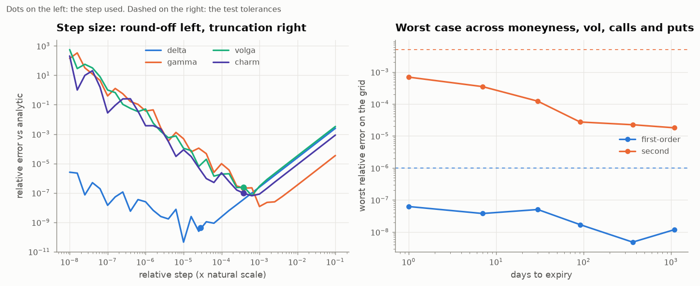
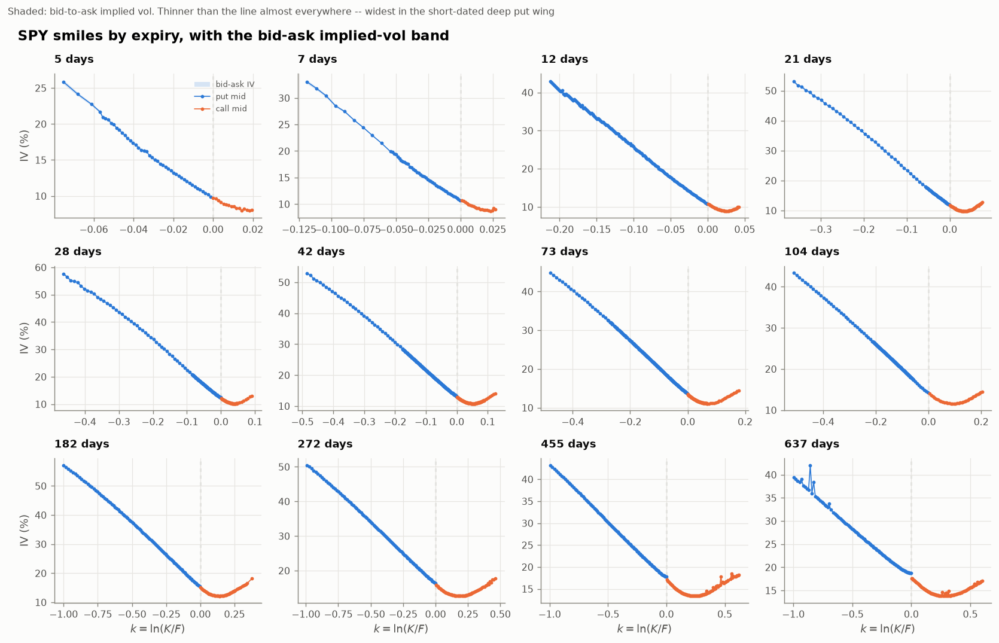
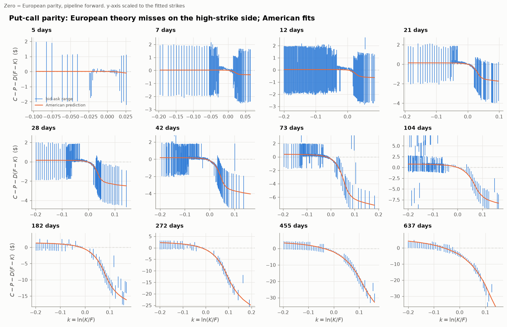

# Options Pricing Engine

**Black-Scholes, binomial trees, Monte Carlo and Heston — built from scratch, validated against each other, and calibrated to a live SPY option chain.**

Every pricer is cross-checked against an independently derived one, every chart is produced by a script you can rerun offline, and the results section says what did *not* work as well as what did.

---

## The 60-second version

| | Result |
|---|---|
| **Analytic** | Black-Scholes price + 9 Greeks, fully vectorised. Every Greek, calls and puts, checked against central differences of the *price* on a 168-point grid down to **1 day** to expiry: worst relative error **6e-8** first-order, **7e-4** second-order ([table](results/greeks_fd.md)). |
| **Lattice** | CRR / Jarrow-Rudd / Leisen-Reimer, European + American. LR at **101 steps** beats CRR at **2,001 steps** (3.4e-5 vs 8.8e-4 error). |
| **Monte Carlo** | Antithetic + control variates: **57x variance reduction** on a European call, **576x** on an arithmetic Asian (geometric-Asian control, ρ = 0.9991). Error bars verified calibrated over 40 replications. |
| **Implied vol** | Safeguarded Newton (`rtsafe`). On a 180-quote stress grid, every quote with vega ≥ 1e-6 comes back to within **2.5e-10** of vol in ≤16 iterations; below that, the price's own round-off sets the floor ([`results/validation.md`](results/validation.md)). |
| **Heston** | Characteristic function ("little trap" branch), two independent quadratures agreeing to 1.6e-8 (max abs price difference), cross-checked against a full-truncation Euler Monte Carlo. |
| **Real data** | 4,469 SPY quotes → 2,012-point surface across 12 expiries. Forward from put-call parity, 0 calendar-arbitrage violations. |
| **Put-call parity** | **44.5%** of the pairs the forward is fitted to break *European* parity by more than the bid-ask spread. Pricing the American early-exercise premium cuts that to **10.6%** and the scatter of the per-strike forwards 2.4–5.6x beyond six months — so SPY's parity "violations" are mostly American exercise, and the pipeline's forward is biased low by up to **85bp** at 21 months ([report](results/parity.md)). Not yet fixed in the surface. |
| **Calibration** | Heston fits the SPY surface to **2.51 vol points** RMSE with 5 parameters, against **10.61** for a Black-Scholes model with one free volatility *per expiry* (12 parameters). Out-of-sample on held-out strikes: **2.38**. |
| **Honest limitation** | That 2.51 is **1.09 vol points in the body** and **5.92 in the short-dated put wing**. Heston cannot generate enough short-dated skew. You need jumps. |

```bash
pip install -r requirements.txt
python scripts/run_analysis.py     # ~4 min, offline from the committed SPY snapshot; writes figures/ and results/
python -m pytest                   # 375 tests, 98% branch coverage, offline
```

**Data behind every market number below:** one SPY option chain captured from Yahoo
Finance at 11:09 ET on 2026-09-18 (spot 759.87, 4,469 quotes, 12 expiries from 5 days to
21 months), and that day's Treasury curve. Both are committed in `data/snapshots/`.

**This is a pricing and calibration project, not a trading strategy**, so there is no
Sharpe ratio, drawdown, turnover or buy-and-hold comparison to report. The results are
pricing errors and model-fit errors, in vol points.

---

## 1. The problem

An option's price is not an opinion, it is a number implied by no-arbitrage plus a model of how the underlying moves. This repo implements that chain end to end:

1. **Price** a vanilla under a given model (three ways, so they can check each other).
2. **Invert** the pricing map: given a market quote, what volatility does it imply?
3. **Build a surface** from a real, messy option chain — which is mostly a data-cleaning and forward-curve problem, not a maths problem.
4. **Fit a model** that can actually reproduce that surface, and be honest about where it cannot.

---

## 2. The maths

### Black-Scholes-Merton

Under the risk-neutral measure the spot is a geometric Brownian motion,

$$dS_t = (r-q)S_t\,dt + \sigma S_t\,dW_t,$$

giving, with $\tau = T-t$,

$$d_1 = \frac{\ln(S/K) + (r - q + \tfrac{1}{2}\sigma^2)\tau}{\sigma\sqrt{\tau}}, \qquad d_2 = d_1 - \sigma\sqrt{\tau},$$

$$C = S e^{-q\tau} N(d_1) - K e^{-r\tau} N(d_2), \qquad P = K e^{-r\tau} N(-d_2) - S e^{-q\tau} N(-d_1).$$

Nine Greeks are implemented analytically: Δ, Γ, vega, Θ, ρ, vanna $\partial^2V/\partial S\partial\sigma$, volga $\partial^2V/\partial\sigma^2$, charm $\partial\Delta/\partial t$, and dual delta $\partial V/\partial K$. (An earlier version said ten, counting the price.) Undiscounted, the put's dual delta is the risk-neutral CDF of $S_T$ and minus the call's is $\mathbb{Q}(S_T > K)$ — which is why call prices must fall, and be convex, in strike.

**How the Greeks are checked.** Each one is compared with a central finite difference of the *price* alone — second-order Greeks, including the mixed partials vanna and charm, are second differences of the price, not differences of the analytic delta or vega. The grid is built for where Greeks break: calls and puts, **1 day** to 3 years, strikes $\pm3$ standard deviations from the forward, 10% and 40% vol, non-zero $r$ and $q$ (84 points per option type, 168 in all). Steps are scaled to each input's natural scale ($S\sigma\sqrt\tau$ for spot, $\sigma$ for vol, $\tau$ for time) and to the price formula's round-off, which is about $\epsilon S$ because the price is a difference of two terms of size $S$; the textbook $\epsilon^{1/3}$, $\epsilon^{1/4}$ steps lose about 10x on one-day gamma and volga. Worst relative error ([full table](results/greeks_fd.md)):

| | Δ | vega | Θ | ρ | dual Δ | Γ | vanna | volga | charm |
|---|---|---|---|---|---|---|---|---|---|
| call | 8.6e-9 | 2.7e-8 | 3.1e-8 | 3.2e-9 | 5.1e-9 | 8.0e-5 | 4.9e-6 | 4.0e-4 | 5.5e-6 |
| put | 2.8e-9 | 5.0e-8 | 6.3e-8 | 7.9e-9 | 8.7e-9 | 4.0e-5 | 1.1e-5 | 6.9e-4 | 6.2e-6 |

17 of the 18 worst cases are at one or seven days to expiry; the volga worst case is the one-day at-the-money option, where volga itself is nearly zero. Tests also plant the classic bugs — vega per vol point, theta per day, a sign flip, a put-only slip in charm — and require each to be caught.




### Binomial lattices

Over one step of length $\Delta t = \tau/n$ the spot moves to $Su$ or $Sd$, with the risk-neutral probability that makes the discounted spot a martingale:

$$p = \frac{e^{(r-q)\Delta t} - d}{u - d}.$$

Three parameterisations are implemented. **Cox-Ross-Rubinstein** uses $u = e^{\sigma\sqrt{\Delta t}}$, $d = 1/u$ and converges as $O(1/n)$ with a sawtooth — the strike drifts between terminal nodes as $n$ changes parity. **Leisen-Reimer** inverts the Peizer-Pratt normal approximation so the tree is centred on the strike; it converges $O(1/n^2)$ and the sawtooth disappears.

American exercise is $\max(\text{continuation}, \text{intrinsic})$ at every node.


The lattice also gives the **early-exercise boundary** — the critical spot below which an American put should be exercised immediately:


### Monte Carlo and variance reduction

European payoffs are priced from exact one-shot lognormal draws, so there is no discretisation bias and the entire error is statistical.

**Antithetic variates** price each draw at $Z$ and $-Z$ and average the pair. A vanilla payoff is monotone in $Z$, so the legs are negatively correlated.

**Control variates** use a correlated variable $X$ with known mean:

$$\hat\theta = \bar Y - \beta(\bar X - \mathbb{E}[X]), \qquad \beta^* = \frac{\operatorname{Cov}(Y, X)}{\operatorname{Var}(X)},$$

reducing variance by $1-\rho^2_{XY}$. For vanillas the control is $S_T$ itself; for arithmetic Asians it is the **geometric** Asian, whose discrete-fixing price is closed form:

$$\sigma_G^2 = \frac{\sigma^2\tau(m+1)(2m+1)}{6m^2}, \qquad \bar t = \frac{\tau(m+1)}{2m}.$$


The right-hand panel is the one that matters for trusting the numbers: it plots realised RMSE over 24 independent runs divided by the standard error those runs *reported*. It sits at 1. The dotted line at $\sqrt{2}$ marks where the classic antithetic bug lands — counting the $Z$ and $-Z$ legs as independent draws leaves the price correct and only the error bar wrong, which is exactly the kind of mistake that survives casual testing.

### Implied volatility

Black-Scholes is strictly increasing in $\sigma$ between the no-arbitrage bounds, so the inverse exists and is unique. Newton-Raphson with analytic vega converges quadratically but is **not globally safe** — vega collapses for deep-ITM/OTM and short-dated strikes, which is where a real chain has most of its rows. The solver is the Numerical-Recipes `rtsafe` hybrid, vectorised: a bracket is maintained at all times, a Newton step is taken when it lands inside the bracket and is at least halving the interval, and bisection is taken otherwise.

### Heston

$$dS_t = (r-q)S_t\,dt + \sqrt{v_t}S_t\,dW^S_t, \qquad dv_t = \kappa(\theta - v_t)\,dt + \xi\sqrt{v_t}\,dW^v_t, \qquad d\langle W^S,W^v\rangle_t = \rho\,dt.$$

No closed-form price, but the characteristic function of $\ln S_T$ is known, so with $F = S_0e^{(r-q)\tau}$, $k = \ln(K/F)$ and $\psi$ the characteristic function of $\ln(S_T/F)$:

$$P_j = \frac12 + \frac1\pi\int_0^\infty \Re\!\left[\frac{e^{-iuk}\,\psi(u - i\,\mathbb{1}_{j=1})}{iu}\right]du, \qquad C = S_0e^{-q\tau}P_1 - Ke^{-r\tau}P_2,$$

$$d = \sqrt{(\rho\xi iu - \kappa)^2 + \xi^2(iu + u^2)}, \quad g = \frac{\kappa - \rho\xi iu - d}{\kappa - \rho\xi iu + d},$$

$$\psi(u) = \exp\!\left(\frac{\kappa\theta}{\xi^2}\Big[(\kappa-\rho\xi iu-d)\tau - 2\ln\tfrac{1-ge^{-d\tau}}{1-g}\Big] + \frac{\kappa-\rho\xi iu-d}{\xi^2}\frac{1-e^{-d\tau}}{1-ge^{-d\tau}}\,v_0\right).$$

---

## 3. Design decisions worth defending

Full log in [DECISIONS.md](DECISIONS.md). The five that changed results:

### The discount factor comes from the rates market; only the forward comes from parity

Put-call parity is model-free: $C(K) - P(K) = D(F-K)$. It is tempting to regress $C-P$ on $K$ and read off **both** $D$ (minus the slope) and $F$ (intercept over $D$). That fit is badly conditioned. On live SPY quotes it returns:

| $\tau$ | implied rate, joint regression | $R^2$ |
|---|---|---|
| 0.014 | **+41.7%** | 0.9998 |
| 0.058 | **−33.3%** | 0.9998 |
| 0.116 | **−19.9%** | 0.9993 |
| 1.746 | +1.0% | 0.9996 |

The line fits beautifully and its slope is meaningless — a 1% error in the slope is a 1% error in $D$, which at $\tau = 0.06$ is a **17 percentage point** error in $r$. The default therefore takes $D$ from the Treasury curve and solves parity for $F$ strike by strike, taking the median. Both methods are kept so the failure is visible rather than asserted, and both are covered by tests.

### The butterfly arbitrage test is spread-aware

SPY lists \$1 strikes near the money, where a one-lot butterfly is worth about as much as the \$0.01 quote tick. A zero-tolerance convexity test on mid prices flags **26%** of strike triples. Netting off the bid-ask cost of all three legs — i.e. asking whether the butterfly is actually *buyable* for a negative amount — leaves **2.9%**. Both numbers are reported, because the gap between them is the interesting one.

### The Monte Carlo control coefficient is fitted after the antithetic fold, not before

This was a real bug in the first version. Fitting $\beta$ on the raw $Z$/$-Z$ legs minimises the variance of an estimator that is not the one being reported. Fixing it changed the combined antithetic+control result from *worse than the control alone* (SE 0.0175) to **57x better than plain Monte Carlo** (SE 0.0043).

### Implied vol converges in volatility space, not price space

Stopping at $|V_{BS}(\sigma) - V_{mkt}| < 10^{-10}$ sounds strict and is not: a five-day 10%-OTM call at 15% vol has vega $2.1\times10^{-6}$, so that price tolerance alone leaves $4.7\times10^{-5}$ of *volatility* error (and at 10% vol the vega is $2.4\times10^{-14}$, where a price stop says nothing about vol at all). The solver therefore also requires the implied vol uncertainty, or the bracket width, to be below $10^{-9}$. That costs a handful of bisection steps; on a 180-quote stress grid the worst vol error is now **2.5e-10** for every quote with vega ≥ 1e-6 ([`results/validation.md`](results/validation.md)).

### The Heston benchmark is one vol per expiry, not one vol overall

A single global Black-Scholes volatility is a straw man. One volatility per expiry already reproduces the entire at-the-money term structure exactly and has *more* free parameters than Heston (12 vs 5). Whatever error it leaves is, by construction, the smile — the only thing a stochastic volatility model can buy you.

---

## 4. Results

### Pricers agree with each other

European call, $S = K = 100$, $\tau = 1$y, $r = 5\%$, $\sigma = 20\%$. Black-Scholes: **10.45058357**.

| Method | Price | Error |
|---|---|---|
| Black-Scholes (analytic) | 10.45058357 | — |
| CRR binomial, 2,001 steps | 10.45145952 | +8.8e-04 |
| Leisen-Reimer, 101 steps | 10.45054934 | −3.4e-05 |
| Monte Carlo, antithetic + control, 200k | 10.45010447 | −4.8e-04 (SE 4.3e-03) |

Variance reduction at matched effective sample counts:

| Scheme | Standard error | Variance reduction |
|---|---|---|
| plain | 0.03290 | 1.0× |
| antithetic | 0.01645 | 4.0× |
| control variate ($S_T$) | 0.01256 | 6.9× |
| **both** | **0.00434** | **57.4×** |
| arithmetic Asian, geometric control | 0.00055 vs 0.01326 | **576×** (ρ = 0.9991) |

The American put on the same parameters is worth **6.0909** (3,001-step CRR tree), a **0.5173** early-exercise premium over the Black-Scholes European put. With no dividends, the American *call* matches the European call on the same 3,001-step tree exactly (difference 0.0, [`results/validation.md`](results/validation.md)) — as it must, since early exercise is never optimal.

Heston is validated three ways: the Black-Scholes limit ($\xi \to 0$) to **1.2e-9**, Gil-Pelaez against Lewis' single-integral form to **1.6e-8** (maximum absolute price differences, [`results/validation.md`](results/validation.md); the unit tests assert 5e-9 and 1e-6), and against a full-truncation Euler Monte Carlo to within one standard error across strikes.

### The SPY volatility surface

Snapshot: **SPY, 2026-09-18 11:09 ET, spot 759.87**. 4,469 raw quotes → 3,880 after cleaning (86.8% kept) → **2,012 surface points** across 12 expiries.


The blank cells are real: short expiries simply do not quote wide strikes, and the pipeline does not extrapolate into them. The same data as a conventional 3-D surface is in [`figures/surface_3d.png`](figures/surface_3d.png) — spaced by $\sqrt{\text{days}}$, because half of SPY's listed expiries fall inside three months and a linear axis crushes all the structure into the front edge.


Textbook equity behaviour: a steep put skew that flattens with maturity, and a call wing that turns back up past roughly $k = +0.07$. At-the-money volatility rises monotonically from **11.2% at 5 days to 18.0% at 1.7 years**.

The overlay shows how the smile changes with expiry; it does not show how well each smile is *known*. Every expiry on its own axes, with the band between the vol implied by the bid and the vol implied by the ask:



At this scale the band is thinner than the line almost everywhere, which is itself the finding: the smile's *shape* is pinned down by the quotes far more tightly than any model below fits it. The band is widest where vega is smallest: a median **0.59–0.75 vol points** in the deep put wing at 12–21 days, against **0.05–0.11** within 5% of the forward at every expiry, and at most 0.13 anywhere past six months (medians by expiry and moneyness bucket, [`results/validation.md`](results/validation.md)). Two consequences. The Heston misses in the short-dated put wing (5–10 vol points, below) are far outside the quotes, so they are model failure, not noise. And the call-minus-put vol gap at the forward on the longest expiries — **−1.08 vol points at 637 days** (median over strikes within 1% of the forward, [`results/parity.md`](results/parity.md)), ten times the 0.11 band there — is not noise either: it is the forward bias from American exercise measured in the parity section below.


Arbitrage checks on the fitted surface:

```
Calendar-spread violations : 0/228 (0.0%)
Butterfly, zero tolerance  : 517/1988 (26.0%)   <- dominated by the $0.01 quote tick
Butterfly, net of spread   :  57/1988 ( 2.9%)
```

### Put-call parity on the snapshot

Full tables in [`results/parity.md`](results/parity.md); every pair in
[`results/parity_pairs.csv`](results/parity_pairs.csv). 1,734 (expiry, strike) pairs have
a two-sided quote on both the call and the put.

**What this can and cannot test.** The pipeline does not know the forward — it infers it
from parity, as the median of $K + (C-P)/D$ over strikes within 10% of spot. So checking
parity against that forward cannot test the *level*: inside the window the median residual
is zero by construction. What it does test is the *shape*. One number per expiry has to
explain 30–230 strikes, so the residuals must be flat in strike and inside each pair's
bid-ask range, and strikes outside the window were not used at all. The level (does the
implied carry match SPY's dividends and funding?) needs data the snapshot does not have.

A pair violates parity **beyond the spread** when $D(F-K)$ lies outside the range the
synthetic can actually be traded at, $[C_{bid} - P_{ask},\ C_{ask} - P_{bid}]$:

| Theory | Strikes | Pairs | Beyond spread | Median excess | 90th pct | Median \|mid residual\| |
|---|---|---|---|---|---|---|
| European, pipeline forward | fitted (±10%) | 897 | **399 (44.5%)** | \$0.14 | \$2.37 | \$0.36 |
| American-adjusted | fitted (±10%) | 897 | **95 (10.6%)** | \$0.05 | \$0.32 | \$0.12 |
| European, pipeline forward | out of sample | 837 | 277 (33.1%) | \$6.81 | \$44.09 | \$0.83 |
| American-adjusted | out of sample | 837 | 281 (33.6%) | \$3.32 | \$28.84 | \$0.70 |



**Why European parity fails: American exercise.** SPY options are American. With rates
near 4%, a deep in-the-money American put is worth about its intrinsic value $K - S$,
while the European put is worth about $Ke^{-r\tau} - Se^{-q\tau}$ — roughly $rK\tau$ less,
\$1.70 on a 10%-ITM put at three weeks. So $C - P$ falls faster in $K$ than $D(F-K)$ once
the put is in the money, and the charts above bend down on the right, more the longer the expiry. That is not
noise: pricing the early-exercise premium of each leg on a binomial tree (American minus
European on the same lattice, at the surface vol, no parameter fitted to the residuals)
predicts the bend, and removing it collapses the scatter of the per-strike forward
estimates:

| Expiry | 21d | 28d | 42d | 73d | 104d | 182d | 272d | 455d | 637d |
|---|---|---|---|---|---|---|---|---|---|
| forward scatter (IQR), European \$ | 1.25 | 1.00 | 0.77 | 1.56 | 0.92 | 2.83 | 2.65 | 3.54 | 4.18 |
| forward scatter (IQR), American \$ | 0.25 | 0.22 | 0.23 | 0.73 | 0.88 | 0.51 | 0.74 | 1.38 | 1.76 |
| forward shift (bp) | +1.8 | +2.1 | +2.5 | +5.2 | +10.5 | +19.0 | +34.1 | +59.2 | +85.3 |

The one expiry where it barely helps is 104 days (0.92 → 0.88). A plausible reason, not
tested: it is the first expiry past SPY's December ex-dividend date, and the tree's
continuous dividend yield cannot price the early exercise of deep-ITM calls just before a
discrete dividend.

A test applies the same adjustment to a synthetic chain that really is European and
requires it to make the fit *worse*, so the improvement on SPY is evidence, not a free
fit. Two things follow for the rest of this README:

* **The pipeline's forward is biased low** — by 2bp at a month and 85bp at 21 months —
  because the ITM puts in the ±10% window drag the median down. That is what the call/put
  step at the forward in the smile plots is: the call-minus-put vol at strikes within 1%
  of the forward is **−1.08 vol points at 637 days** with the pipeline's forward and
  **+0.18** after de-Americanising both legs and using the adjusted forward (−0.51 → +0.10
  at 455 days). The fix is measured here but **not wired into the surface**, so the Heston
  numbers below still carry it; see [DECISIONS.md](DECISIONS.md).
* **What is left in-sample is small** — median 5 cents beyond the spread, mostly in the 5- to
  12-day expiries, where a few cents is what a slightly stale spot print or unsynchronised
  quotes would produce.

**Out of sample, the failures are stale quotes.** Outside the window the violation rate
does not improve, because the violators are not model failures. They are deep-ITM quotes
that are arbitrageable *on their own*, with no model and no forward:

* **72 quotes are offered below intrinsic** — mostly deep-ITM long-dated calls. SPY options
  are American, so you could buy one and exercise it immediately at a profit. The spot that
  would make them fair goes as low as \$675, against \$760 at the snapshot.
* **100 adjacent-strike pairs are not monotone** — a call bid above the next-lower strike's
  call ask (or the put mirror image), a free vertical spread.
* **128 pairs breach the American bound $C - P \le S - Ke^{-r\tau}$**, which needs neither a
  forward nor a dividend forecast (only spot and the Treasury rate); 105 of them (82%) are at
  strikes more than 5% below spot, i.e. deep in-the-money calls.

None of these can exist in a live market. The snapshot carries last-trade times but no quote
times, so this is the closest the data gets to measuring staleness directly — and it is
why the surface is built from out-of-the-money quotes only.

### Heston calibration

Calibrated on 468 thinned quotes. All four multi-start seeds converge to the same optimum (RMSE spread 2.5063–2.5063 vol points), which is worth stating because Heston objectives are genuinely multimodal.

$$v_0 = 0.0130, \quad \kappa = 6.42, \quad \theta = 0.0473, \quad \xi = 1.96, \quad \rho = -0.680$$

| Model | Free parameters | RMSE (vol pts) | MAE | Max |
|---|---|---|---|---|
| Black-Scholes, one vol | 1 | 11.23 | 8.63 | 35.44 |
| Black-Scholes, one vol per expiry | 12 | 10.61 | 8.25 | 32.08 |
| **Heston** | **5** | **2.51** | **1.37** | **10.91** |


**It is not overfitting.** Fitting on alternate strikes within each expiry and scoring on
the rest:

| Model | In-sample RMSE | Out-of-sample RMSE | Ratio |
|---|---|---|---|
| Black-Scholes, one vol | 11.43 | 10.95 | 0.96 |
| Black-Scholes, one vol per expiry | 10.80 | 10.31 | 0.95 |
| **Heston** | **2.55** | **2.38** | **0.93** |

All three degrade by nothing — with 5 parameters against 234 training quotes there is
nothing to overfit — and Heston's advantage survives intact. Strikes are interleaved
*within* each expiry rather than holding out whole expiries, because the latter tests
extrapolation in maturity, which is a different and much harder question.

**The parameters are estimated more precisely than they are identified.** Asymptotic
standard errors from the Jacobian at the optimum:

| | v0 | κ | θ | ξ | ρ |
|---|---|---|---|---|---|
| estimate | 0.0130 | 6.416 | 0.0473 | 1.961 | −0.680 |
| std. error | 0.0003 | 0.246 | 0.0004 | 0.053 | 0.006 |
| relative | 2.4% | 3.8% | 0.8% | 2.7% | 0.9% |

Those look tight, and they overstate the case: the calculation assumes independent
residuals, and adjacent strikes on an option chain are strongly dependent, so the true
uncertainty is larger. The more useful output is the correlation matrix, where
**corr(κ, ξ) = +0.83** and **corr(κ, θ) = −0.79**. Raising the mean-reversion speed and
the vol-of-vol together leaves the smile almost unchanged — which is the quantitative
version of the standard warning that a single surface does not identify κ and ξ
separately, and is why the parameter-recovery test has to give those two a looser
tolerance than v0, θ and ρ.

### What did not work

**Heston cannot fit the short-dated put wing.** The headline 2.51 vol points decomposes into **1.09 in the body** ($|k| < 0.15$) and **5.92 in the short-dated put wing** ($k < -0.15$, $\tau < 0.15$). The 12- and 28-day panels above show it clearly: the model smile is 5–10 vol points below the market in the deep puts.

This is not a calibration failure, it is the model. Heston generates skew through the correlation $\rho$ acting over time — the spot has to diffuse somewhere for the stochastic variance to matter. Over two weeks there is not enough time, so the model's short-dated smile is nearly flat while the market's is very steep. Reproducing it needs a jump component (Bates, or a Lévy model). The calibration then trades off: it picks a large $\xi = 1.96$ trying to bend the front smile, which is why the **Feller condition is violated** ($2\kappa\theta/\xi^2 = 0.16$). That is typical of equity index calibrations and is fine for the characteristic function, though it would need care in a simulation scheme.


**The implied dividend yield comes out too low, and fixing American exercise makes it lower.** Backing $q$ out of the parity forward with Treasury discounting gives ~0.3% at long maturities, against SPY's actual ~1.1%. The American-adjusted forward is *higher*, so its implied $q$ is about −0.1% to −0.2% beyond six months (table in [`results/parity.md`](results/parity.md)). Parity cannot say why: the forward is inferred from the same quotes, so only the carry $r - q$ is identified, and splitting it needs a dividend forecast and the dealers' funding rate, neither of which is in the data. The most likely culprit is funding — options are financed at OIS/repo-type rates, not Treasury yields — but that is a hypothesis, not a measurement. The surface itself is unaffected by the split: it is built from the forward directly (i.e. Black-76), so the $r$/$q$ split never enters a price.

**The call/put mismatch at the forward was mostly American exercise, not quote noise.** An earlier version of this README said call and put vols meet at the forward with a ~0.5 vol point gap that "needs better quotes". Measured properly (median over strikes within 1% of the forward), the gap is within ±0.26 vol points out to nine months (−0.25 at 182 days, −0.26 at 272 days) and then widens to **−0.51 at 455 days and −1.08 at 637 days**, and it closes to about **0.2 or less** at every expiry once both legs are de-Americanised and the adjusted forward is used — see the parity section above. The bias is not yet removed from the surface.

---

## 5. Limitations

- **Quotes are not simultaneous, and some are stale.** Yahoo mids come from different moments across the chain; 72 quotes in the snapshot are offered below intrinsic and 100 adjacent-strike pairs are not monotone, which no live quote could be. This is the dominant error source in the deep ITM legs and it caps how much of the remaining butterfly violation rate is real.
- **Mid prices, not a fitted fair value.** For wide-spread contracts the mid is a convention, not a price.
- **American exercise is ignored in the surface.** For the OTM quotes the surface is built from, the early-exercise premium is small. But the *forward* is fitted to ITM legs too, and there it is not small: the forward is biased low by up to 85bp at 21 months, which puts a ~1 vol point call/put step at the forward of the longest expiry. The parity module measures and removes it; the surface and Heston fit do not yet use it. The binomial adjustment also assumes a continuous dividend yield, so it misses the pre-ex-date exercise of deep ITM calls that SPY's discrete dividends create. It is *not* negligible for single stocks around dividends, so this pipeline should not be pointed at them unchanged.
- **Heston has no jumps**, hence the wing failure above. Bates or a Lévy model is the next step.
- **One snapshot.** Calibration stability *across days* (how much the parameters move when the surface barely does) is the standard practitioner complaint about Heston and is not measured here.
- **The Treasury curve is a proxy for OIS.** A few basis points at these maturities — far less than the bid-ask.
- **No transaction costs in any P&L sense.** This repo prices and fits; it does not trade. There is no backtest here to bias.

---

## 6. Repository layout

```
src/optpricing/
  types.py         Shared enums and array types
  blackscholes.py  Analytic price + 9 Greeks, vectorised
  greeks_check.py  Every Greek vs finite differences of the price, over a stress grid
  binomial.py      CRR / Jarrow-Rudd / Leisen-Reimer, European + American, exercise boundary
  montecarlo.py    Exact GBM draws, antithetic + control variates, Asian options
  implied_vol.py   Vectorised safeguarded Newton (rtsafe)
  heston.py        Characteristic function, two quadratures, Euler MC cross-check
  calibration.py   Multi-start least squares + Black-Scholes benchmarks
  data.py          Cached yfinance chains, rate curve, parity forward extraction
  surface.py       Surface construction (mid, bid and ask vols), arbitrage checks, thinning
  parity.py        Put-call parity residuals, American adjustment, stale-quote checks
  style.py         One validated chart palette
  plotting.py      Every figure in this README
scripts/run_analysis.py   Full pipeline
tests/                    375 tests, 98% statement + branch coverage
data/snapshots/           Committed SPY chain so results reproduce offline
```

## 7. Running it

```bash
python -m venv .venv && source .venv/bin/activate
pip install -r requirements.txt

python scripts/run_analysis.py --ticker SPY          # uses the most recent cached chain
python scripts/run_analysis.py --ticker QQQ --refresh  # downloads a live chain (use during market hours)

python -m pytest                                     # full suite
python -m pytest --cov=optpricing --cov-branch --cov-report=term-missing
ruff check src tests scripts && mypy src scripts
```

Without `--refresh` the analysis always uses the most recent cached chain, and the rate
curve from the same day, so results do not change with the date you run it. With
`--refresh` it downloads a live chain into `data/raw/`. On a weekend or overnight most live
quotes are one-sided and get cleaned out, so refresh during market hours.
