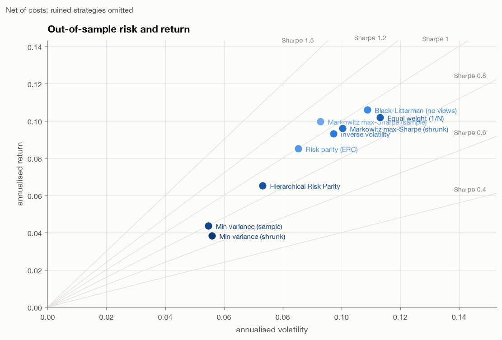
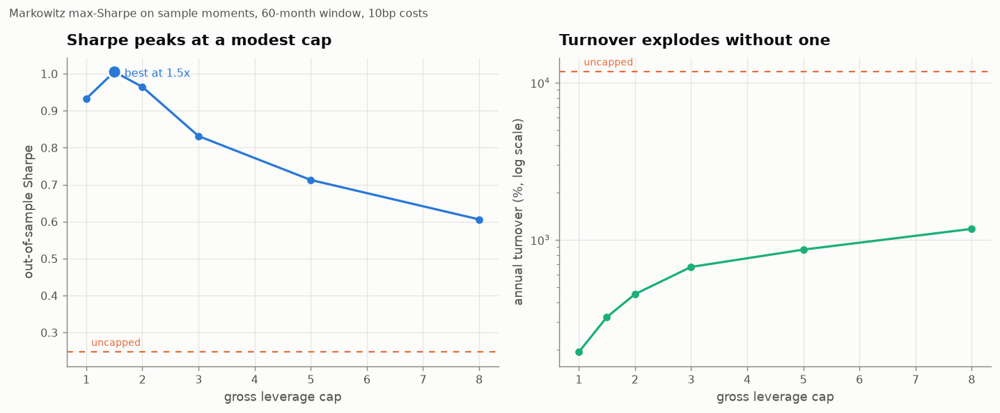

# Portfolio Optimization

**Markowitz, Ledoit-Wolf shrinkage, risk parity, HRP and Black-Litterman, implemented from
scratch and compared out of sample against 1/N and buy-and-hold SPY.**

The finding: after costs, with the risk-free rate subtracted, **none of the nine
construction methods has a Sharpe ratio that is statistically distinguishable from 1/N or
from buying SPY.** The part that does break is leverage. Unconstrained mean-variance
portfolios lose up to 95% in a month, and a modest leverage cap removes almost all of the
damage.

```bash
pip install -r requirements.txt
python scripts/run_analysis.py     # ~8 min, offline from committed snapshots; writes figures/ and results/
python -m pytest                   # 67 tests, offline
```

## Problem

Mean-variance optimisation is optimal if you know expected returns and covariances. You
don't. You estimate them, and the optimiser amplifies the estimation error. This
project asks how much of the textbook's theoretical advantage survives in practice:
monthly rebalancing, estimates from a trailing window only, trading costs, and a
benchmark that costs nothing to run.

## Method

| | |
|---|---|
| **Universe** | 15 ETFs: 9 US sector SPDRs, REITs, developed and emerging equity, 7-10y and 20y+ Treasuries, gold |
| **Data** | Yahoo Finance adjusted closes (dividends reinvested), 2004-11-18 to 2026-09-18, monthly. The partial final month is dropped, leaving 261 months to 2026-08. The snapshot is committed in `data/snapshots/` |
| **Out-of-sample test** | Walk-forward. At each month end, estimate from the previous 60 months only, set weights, and earn the *next* month's return. A runtime check raises if the estimation window ever reaches the scored month |
| **Out-of-sample period** | 2009-12 to 2026-08, 201 months |
| **Costs** | 10 bp one way on turnover, measured against the weights *after* they drift during the month. 50 bp a year stock-loan fee on short positions |
| **Risk-free** | 13-week T-bill yield (`^IRX`), lagged one month so the rate is known in advance. Averaged 1.75% a year. Every Sharpe below is on excess returns |
| **Benchmarks** | Equal weight (1/N), rebalanced monthly, and buy-and-hold SPY over the same months |
| **Significance** | Lo (2002) 95% interval for each Sharpe, and a paired Jobson-Korkie test with the Memmel correction for "same Sharpe as 1/N" |

Implemented from scratch and tested against closed forms or independent references:
- Ledoit-Wolf shrinkage (matches scikit-learn to 1e-14).
- Closed-form efficient frontier (GMV variance = 1/A).
- Constrained max-Sharpe via a convex reformulation.
- Equal risk contribution.
- HRP (leaf order matches scipy).
- Black-Litterman (no-view posterior equals the prior, and the tangency portfolio of the prior is the market).

## Results

Out of sample, 2009-12 to 2026-08, net of costs, long-only, 60-month estimation window:

| Strategy | Return | Vol | **Sharpe** | 95% CI | Max DD | Turnover/yr | p vs 1/N |
|---|---|---|---|---|---|---|---|
| Markowitz max-Sharpe (sample) | 10.0% | 9.3% | **0.93** | 0.45 to 1.42 | -24.0% | 193% | 0.54 |
| SPY buy-and-hold (benchmark) | 14.3% | 14.3% | **0.91** | 0.42 to 1.40 | -23.9% | 0% | 0.26 |
| Black-Litterman (no views) | 10.8% | 10.9% | **0.86** | 0.38 to 1.35 | -22.5% | 36% | 0.28 |
| Risk parity (ERC) | 8.7% | 8.5% | **0.85** | 0.37 to 1.34 | -18.7% | 43% | 0.54 |
| Inverse volatility | 9.5% | 9.7% | **0.84** | 0.35 to 1.32 | -18.9% | 39% | 0.39 |
| Markowitz max-Sharpe (shrunk) | 9.7% | 10.1% | **0.83** | 0.35 to 1.32 | -25.5% | 217% | 0.89 |
| Equal weight (1/N) | 10.4% | 11.3% | **0.80** | 0.32 to 1.29 | -18.1% | 37% | — |
| Hierarchical Risk Parity | 6.7% | 7.3% | **0.73** | 0.24 to 1.21 | -18.2% | 122% | 0.62 |
| Min variance (sample) | 4.5% | 5.5% | **0.57** | 0.08 to 1.05 | -16.9% | 49% | 0.27 |
| Min variance (shrunk) | 4.0% | 5.6% | **0.46** | -0.02 to 0.95 | -19.7% | 53% | 0.15 |

Return is geometric and annualised. Turnover is one-way. Full table: [results/walk_forward.md](results/walk_forward.md).



**What this says:**

- **No method beats 1/N with any confidence.** The largest gap, Markowitz at 0.93 vs 0.80,
  has p = 0.54. With 17 years of monthly data, a Sharpe ratio's standard error is about
  0.25, so a ranking by point estimate is mostly noise.
- **SPY buy-and-hold is as good as anything here on Sharpe, and better on return.** It
  earned 14.3% a year against 10-11% for the best diversified portfolios, at a similar
  drawdown. That comparison is period-specific. Over the same 201 months SPY returned 14.3% a
  year, against 2.0-2.3% for Treasuries (TLT, IEF), 5.3% for emerging markets, 7.2% for
  developed international and 7.8% for gold. Diversifying away from US equity was a
  drag over this particular period.
- **Costs are not the issue for long-only portfolios.** Even Markowitz's ~190% a year
  turnover costs only 0.2% a year at 10 bp.
- **Shrinking the covariance did not help max-Sharpe here** (0.83 vs 0.93, p = 0.89 vs 1/N).
  The optimiser still leans on noisy sample mean returns, which shrinkage does not touch.

### What actually breaks Markowitz: leverage

Same optimiser and data, allowing shorts up to a gross leverage cap:

| Gross leverage cap | Sharpe | Return | Max DD | Turnover/yr | Borrow cost/yr | Mean leverage | Worst month |
|---|---|---|---|---|---|---|---|
| 1.0 (long-only) | 0.93 | 10.0% | -24.0% | 193% | 0.00% | 1.00 | -9.7% |
| 1.5x | 1.01 | 10.2% | -21.1% | 322% | 0.12% | 1.50 | -8.6% |
| 2x | 0.96 | 10.0% | -18.4% | 451% | 0.25% | 2.00 | -10.3% |
| 3x | 0.83 | 9.3% | -18.8% | 672% | 0.45% | 2.82 | -11.6% |
| 5x | 0.71 | 9.7% | -22.8% | 867% | 0.62% | 3.50 | -15.8% |
| 8x | 0.61 | 10.8% | -31.5% | 1,174% | 0.80% | 4.20 | -22.4% |
| uncapped | 0.25 | -3.2% | -99.0% | 11,763% | 2.02% | 9.08 (peak 553) | **-94.8%** |



The uncapped portfolio is effectively wiped out: it loses 94.8% in a single month and
compounds to -3.2% a year. Its Sharpe is still *positive* (0.25), because Sharpe uses the
arithmetic mean, which a -95% month barely dents. This is why the backtest reports ruin and
worst month next to Sharpe. The small peak at 1.5x (1.01 vs 0.93 long-only) is well
inside the noise band above and should not be read as an optimum.

Shorter estimation windows make it worse. With a 24- or 36-month window the unconstrained
long-short portfolio loses more than 100% of capital. Long-only portfolios stay intact at
every window tested, from 24 to 120 months.

## Limitations

- **The universe was picked today.** These 15 ETFs all still exist and are liquid. A
  broad-asset-class ETF universe has much less survivorship bias than a stock universe,
  but the choice of asset classes is made with hindsight.
- **One sample, one window.** The lookback-sensitivity runs start on different dates
  (a longer window starts later), so they are not a paired comparison.
- **The optimiser ignores the risk-free rate when choosing weights.** It maximises μ/σ,
  not (μ − r<sub>f</sub>)/σ. Evaluation always subtracts r<sub>f</sub>. With no cash asset
  in the portfolio this changes which frontier point is chosen, not whether the
  comparison is fair.
- **Black-Litterman's market weights are a fixed assumption**, roughly today's global
  market mix, applied throughout the backtest. That is a mild form of lookahead in the
  prior. They are documented in `src/portopt/data.py`.
- **Costs are linear.** There's no market impact, which is reasonable for liquid ETFs at
  small size and wrong for large size. Borrow is one flat rate for every ETF and every year.
- **The significance tests assume IID returns.** Monthly returns are fat-tailed and mildly
  autocorrelated, so the true intervals are somewhat wider than shown.
- **The in-sample sections of the script** (full-sample frontier, Black-Litterman view
  example) use all the data by design, to illustrate the methods. They are not performance
  claims.

## How to run

```bash
python3 -m venv .venv && . .venv/bin/activate
pip install -r requirements.txt
python scripts/run_analysis.py                 # writes figures/*.png and results/*.{json,md}
python scripts/run_analysis.py --lookback 36   # other options: --cost-bps, --borrow-bps, --refresh
python -m pytest
```

`--refresh` re-downloads prices, the T-bill series and SPY instead of using the committed
snapshots. The results will then change slightly, because Yahoo revises adjusted history.

## Layout

```
src/portopt/
  data.py           prices, T-bill risk-free rate, SPY benchmark, snapshots
  covariance.py     sample, EWMA, Ledoit-Wolf (identity and constant-correlation targets)
  optimizers.py     closed-form frontier, min variance, max Sharpe with leverage caps
  riskparity.py     inverse volatility, equal risk contribution
  hrp.py            hierarchical risk parity
  blacklitterman.py equilibrium returns and view blending
  backtest.py       walk-forward engine: drift, turnover, costs, borrow, buy-and-hold
  metrics.py        excess-return Sharpe with CI, drawdown, paired Sharpe test
  strategies.py     the comparison set
scripts/run_analysis.py
tests/              67 tests
```
