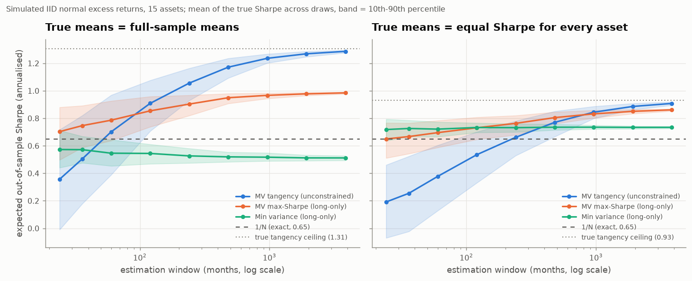

# Portfolio Optimization

**Markowitz, Ledoit-Wolf shrinkage, risk parity, HRP and Black-Litterman, implemented from
scratch and compared out of sample against 1/N and buy-and-hold SPY.**

The finding: after costs, with the risk-free rate subtracted, **none of the nine
construction methods has a Sharpe ratio that is statistically distinguishable from 1/N or
from buying SPY.** The part that does break is leverage. Unconstrained mean-variance
portfolios lose up to 95% in a month, and a modest leverage cap removes almost all of the
damage.

```bash
pip install -r requirements.txt
python scripts/run_analysis.py       # ~10-13 min, offline from committed snapshots; writes figures/ and results/
python scripts/estimation_window.py  # ~5 min, the estimation-window experiment
python -m pytest                     # 80 tests, offline
```

## Problem

Mean-variance optimisation is optimal if you know expected returns and covariances. You
don't. You estimate them, and the optimiser amplifies the estimation error. This
project asks how much of the textbook's theoretical advantage survives in practice:
monthly rebalancing, estimates from a trailing window only, trading costs, and a
benchmark that costs nothing to run.

## Method

| | |
|---|---|
| **Universe** | 15 ETFs: 9 US sector SPDRs, REITs, developed and emerging equity, 7-10y and 20y+ Treasuries, gold |
| **Data** | Yahoo Finance adjusted closes (dividends reinvested), 2004-11-18 to 2026-09-18, monthly. The partial final month is dropped, leaving 261 months to 2026-08. The snapshot is committed in `data/snapshots/` |
| **Out-of-sample test** | Walk-forward. At each month end, estimate from the previous 60 months only, set weights, and earn the *next* month's return. A runtime check raises if the estimation window ever reaches the scored month, and a test overwrites every return after a date with garbage and checks that no strategy's weights or returns up to that date change |
| **Covariance** | Sample, or Ledoit-Wolf shrinkage towards constant correlation (used by risk parity, "shrunk" min variance and max-Sharpe, and Black-Litterman). Its intensity averaged 0.20 (range 0.11 to 0.35) across the 201 walk-forward windows |
| **Out-of-sample period** | 2009-12 to 2026-08, 201 months |
| **Costs** | 10 bp one way on turnover, measured against the weights *after* they drift during the month. 50 bp a year stock-loan fee on short positions |
| **Risk-free** | 13-week T-bill yield (`^IRX`), lagged one month so the rate is known in advance. Averaged 1.75% a year. Every Sharpe below is on excess returns |
| **Benchmarks** | Equal weight (1/N), rebalanced monthly, and buy-and-hold SPY over the same months |
| **Significance** | Lo (2002) 95% interval for each Sharpe, and a paired Jobson-Korkie test with the Memmel correction for "same Sharpe as 1/N" |

Implemented from scratch and tested against closed forms or independent references:
- Ledoit-Wolf shrinkage. The identity target (2004) matches `sklearn.covariance.LedoitWolf`
  to 1e-14. The constant-correlation target (2003), which is the one the backtest uses,
  has no sklearn equivalent. It is checked against an element-by-element transcription of
  the paper's formula, and a simulation checks that its intensity lands within 0.02 of the
  oracle intensity.
- Closed-form efficient frontier (GMV variance = 1/A).
- Constrained max-Sharpe via a convex reformulation.
- Equal risk contribution.
- HRP (leaf order matches scipy).
- Black-Litterman (no-view posterior equals the prior, and the tangency portfolio of the prior is the market).

## Results

Out of sample, 2009-12 to 2026-08, net of costs, long-only, 60-month estimation window:

| Strategy | Return | Vol | **Sharpe** | 95% CI | Max DD | Turnover/yr | p vs 1/N |
|---|---|---|---|---|---|---|---|
| Markowitz max-Sharpe (sample) | 10.0% | 9.3% | **0.93** | 0.45 to 1.42 | -24.0% | 193% | 0.54 |
| SPY buy-and-hold (benchmark) | 14.3% | 14.3% | **0.91** | 0.42 to 1.40 | -23.9% | 0% | 0.26 |
| Markowitz max-Sharpe (shrunk) | 9.9% | 9.8% | **0.88** | 0.39 to 1.36 | -25.3% | 207% | 0.73 |
| Black-Litterman (no views) | 10.8% | 10.9% | **0.86** | 0.38 to 1.35 | -22.5% | 36% | 0.28 |
| Risk parity (ERC) | 8.5% | 8.3% | **0.85** | 0.37 to 1.34 | -18.6% | 44% | 0.60 |
| Inverse volatility | 9.5% | 9.7% | **0.84** | 0.35 to 1.32 | -18.9% | 39% | 0.39 |
| Equal weight (1/N) | 10.4% | 11.3% | **0.80** | 0.32 to 1.29 | -18.1% | 37% | — |
| Hierarchical Risk Parity | 6.7% | 7.3% | **0.73** | 0.24 to 1.21 | -18.2% | 122% | 0.62 |
| Min variance (sample) | 4.5% | 5.5% | **0.57** | 0.08 to 1.05 | -16.9% | 49% | 0.27 |
| Min variance (shrunk) | 4.2% | 5.5% | **0.51** | 0.03 to 0.99 | -18.8% | 55% | 0.20 |

Return is geometric and annualised. Turnover is one-way. Full table: [results/walk_forward.md](results/walk_forward.md).


**What this says:**

- **No method beats 1/N with any confidence.** The largest gap, Markowitz at 0.93 vs 0.80,
  has p = 0.54. With 17 years of monthly data, a Sharpe ratio's standard error is about
  0.25, so a ranking by point estimate is mostly noise.
- **SPY buy-and-hold is as good as anything here on Sharpe, and better on return.** It
  earned 14.3% a year against 10-11% for the best diversified portfolios, at a similar
  drawdown. That comparison is period-specific. Over the same 201 months SPY returned 14.3% a
  year, against 2.0-2.3% for Treasuries (TLT, IEF), 5.3% for emerging markets, 7.2% for
  developed international and 7.8% for gold. Diversifying away from US equity was a
  drag over this particular period.
- **Costs are not the issue for long-only portfolios.** Even Markowitz's ~190% a year
  turnover costs only about 19 bp a year at 10 bp, 0.02 of Sharpe (table below).
- **Shrinking the covariance did not help max-Sharpe here** (0.88 vs 0.93, p = 0.73 vs 1/N).
  The optimiser still leans on noisy sample mean returns, which shrinkage does not touch.

### Turnover and transaction costs

Same run: 10 bp one way on turnover, 50 bp a year borrow on shorts (none of these hold any).

| Strategy | Turnover per rebalance | Turnover/yr | Cost drag (bp/yr) | Gross Sharpe | Net Sharpe |
|---|---|---|---|---|---|
| Markowitz max-Sharpe (shrunk) | 16.8% | 207% | 20.7 | 0.90 | 0.88 |
| Markowitz max-Sharpe (sample) | 15.7% | 193% | 19.3 | 0.95 | 0.93 |
| Hierarchical Risk Parity | 9.7% | 122% | 12.2 | 0.75 | 0.73 |
| Min variance (shrunk) | 4.1% | 55% | 5.5 | 0.52 | 0.51 |
| Min variance (sample) | 3.6% | 49% | 4.9 | 0.58 | 0.57 |
| Risk parity (ERC) | 3.1% | 44% | 4.3 | 0.86 | 0.85 |
| Inverse volatility | 2.8% | 39% | 3.9 | 0.84 | 0.84 |
| Equal weight (1/N) | 2.6% | 37% | 3.7 | 0.81 | 0.80 |
| Black-Litterman (no views) | 2.5% | 36% | 3.6 | 0.87 | 0.86 |
| SPY buy-and-hold (benchmark) | 0% | 0% | 0.0 | 0.91 | 0.91 |

Turnover per rebalance is one-way, per month, and leaves out the initial purchase from cash.
Turnover/yr includes it (100% spread over 16.75 years, about 6% a year for every strategy), so
cost drag = 10 bp × turnover/yr exactly. 1/N still trades 2.6% a month, because the weights
drift away from equal and have to be reset. Sharpe is on excess returns in both columns.
The Sharpe drop is 0.02 at most, well under the ±0.5 confidence band. At these costs, what
separates the methods is estimation error, not trading. `run_analysis.py` also reruns
everything at 0, 5, 25 and 50 bp (section 7 of its output). Full table:
[results/costs.md](results/costs.md).

### What actually breaks Markowitz: leverage

Same optimiser and data, allowing shorts up to a gross leverage cap:

| Gross leverage cap | Sharpe | Return | Max DD | Turnover/yr | Borrow cost/yr | Mean leverage | Worst month |
|---|---|---|---|---|---|---|---|
| 1.0 (long-only) | 0.93 | 10.0% | -24.0% | 193% | 0.00% | 1.00 | -9.7% |
| 1.5x | 1.01 | 10.2% | -21.1% | 322% | 0.12% | 1.50 | -8.6% |
| 2x | 0.96 | 10.0% | -18.4% | 451% | 0.25% | 2.00 | -10.3% |
| 3x | 0.83 | 9.3% | -18.8% | 672% | 0.45% | 2.82 | -11.6% |
| 5x | 0.71 | 9.7% | -22.8% | 867% | 0.62% | 3.50 | -15.8% |
| 8x | 0.61 | 10.8% | -31.5% | 1,174% | 0.80% | 4.20 | -22.4% |
| uncapped | 0.25 | -3.2% | -99.0% | 11,763% | 2.02% | 9.08 (peak 553) | **-94.8%** |


The uncapped portfolio is effectively wiped out: it loses 94.8% in a single month and
compounds to -3.2% a year. Its Sharpe is still *positive* (0.25), because Sharpe uses the
arithmetic mean, which a -95% month barely dents. This is why the backtest reports ruin and
worst month next to Sharpe. The small peak at 1.5x (1.01 vs 0.93 long-only) is well
inside the noise band above and should not be read as an optimum.

Shorter estimation windows make it worse. With a 24- or 36-month window the unconstrained
long-short portfolio loses more than 100% of capital. Long-only portfolios stay intact at
every window tested, from 24 to 120 months.

## Why estimation error kills mean-variance

DeMiguel, Garlappi and Uppal (2009), "Optimal Versus Naive Diversification: How
Inefficient is the 1/N Portfolio Strategy?", *Review of Financial Studies* 22(5), tested 14
optimised portfolio rules against 1/N on seven empirical datasets, out of sample with rolling
estimation windows. None was consistently better than 1/N on Sharpe ratio, certainty-equivalent
return or turnover. Their paired Sharpe test is the same Jobson-Korkie/Memmel test used here.
They also derived how long the estimation window has to be for sample-based mean-variance
to beat 1/N. For parameters calibrated to the US equity market, it is about 3000 months
for 25 assets and about 6000 months for 50 assets.

**The mechanism.** Mean-variance weights are proportional to Σ̂⁻¹μ̂, so any error in the
inputs goes into the weights, and two things make it large:

- **Means are nearly unknowable.** The standard error of a sample mean is σ/√T. For an
  asset with 15% volatility and a 60-month window, the annualised mean is only known to
  within ±6.7% a year (one standard error). That is larger than most of the true differences
  between these ETFs' expected returns. The optimiser cannot tell signal from noise, so it
  bets on noise.
- **The inverse covariance amplifies it.** With 15 assets and 60 months (N/T = 0.25), the
  sample covariance of the last 60 months has a condition number of 668. Ledoit-Wolf
  shrinkage brings it down to 198. The optimiser puts the most weight on the directions
  where the estimate is least reliable.

The gain from optimising is the gap between the true tangency portfolio and 1/N. The loss
is estimation error, which shrinks only slowly as T grows. Mean-variance wins only once the gain is
bigger than the loss. In DeMiguel et al.'s equity calibration the gain is small, so T has to
be enormous.

**The same experiment on this universe** (`scripts/estimation_window.py`,
[results/estimation_window.md](results/estimation_window.md)). Treat this universe's
2004-12 to 2026-08 monthly excess-return moments as the truth. Draw IID normal samples of
each window length, build each portfolio from the estimates, and score it by its *true*
Sharpe ratio. There are 200 draws per window. The true means are set in two ways, both
fixed before looking at the output: (A) the full-sample means, and (B) the same Sharpe
ratio for every asset.



| | (A) sample means | (B) equal Sharpe |
|---|---|---|
| True Sharpe of 1/N | 0.65 | 0.65 |
| True tangency Sharpe (the ceiling) | 1.31 | 0.93 |
| Shortest window where unconstrained sample MV beats 1/N on average | 60 months | 240 months |
| ... where long-only sample max-Sharpe does | 24 months | 36 months |
| Expected Sharpe of long-only max-Sharpe with a 60-month window | 0.79 | 0.70 |

In this universe, the window needed is far shorter than DeMiguel et al.'s 3000 months. The
reason is that 1/N here is a poor portfolio: 11 of the 15 ETFs are equities, so 1/N is
mostly equity risk and sits well below the frontier. That makes the gain from optimising
large under either calibration. Both calibrations favour mean-variance. Returns are IID and
stationary, with no costs. Calibration (A) also takes an in-sample optimum as the truth, and
its 1.31 ceiling is inflated by the same estimation error the experiment is about. So these
windows are best-case numbers.

**Why that still does not produce a winner.** Even in the best case, the expected edge of
long-only max-Sharpe over 1/N with a 60-month window is 0.05 to 0.14 of Sharpe. Real data
can't resolve an edge that size. Take the walk-forward again, with every window scored on
the same 141 months (2014-12 to 2026-08), 10 bp costs:

| Window (months) | N/T | Max-Sharpe Sharpe | 1/N Sharpe | Difference | Std. error | p |
|---|---|---|---|---|---|---|
| 24 | 0.63 | 0.52 | 0.67 | -0.14 | 0.24 | 0.55 |
| 36 | 0.42 | 0.55 | 0.67 | -0.12 | 0.23 | 0.60 |
| 60 | 0.25 | 0.82 | 0.67 | +0.15 | 0.22 | 0.48 |
| 90 | 0.17 | 0.79 | 0.67 | +0.13 | 0.22 | 0.56 |
| 120 | 0.13 | 0.83 | 0.67 | +0.16 | 0.23 | 0.48 |

The direction matches the theory. Short windows (N/T above 0.4) lose to 1/N and longer ones
gain. But every difference is well inside one standard error of about 0.22. At that noise
level, a true edge of 0.10 would take about 2,500 to 3,200 months of data before it reached
p = 0.05 even half the time. That is a different quantity from DeMiguel et al.'s 3000 months,
which is the window needed for the edge to exist at all. It makes the same practical point:
with 17 years of monthly data, "beats 1/N" cannot be established either way. The honest
summary is a null result.

## Limitations

- **The universe was picked today.** These 15 ETFs all still exist and are liquid. A
  broad-asset-class ETF universe has much less survivorship bias than a stock universe,
  but the choice of asset classes is made with hindsight.
- **One sample, one window.** The lookback-sensitivity runs in `run_analysis.py` start on
  different dates (a longer window starts later), so they are not a paired comparison. The
  paired version, with every window scored on the same months, is in
  `scripts/estimation_window.py`. It covers only 141 months.
- **The estimation-window simulation is a best case for mean-variance.** It assumes IID
  normal, stationary returns and no costs, and its two calibrations of the true means are
  assumptions, not estimates of the truth.
- **The optimiser ignores the risk-free rate when choosing weights.** It maximises μ/σ,
  not (μ − r<sub>f</sub>)/σ. Evaluation always subtracts r<sub>f</sub>. With no cash asset
  in the portfolio this changes which frontier point is chosen, not whether the
  comparison is fair.
- **Black-Litterman's market weights are a fixed assumption**, roughly today's global
  market mix, applied throughout the backtest. That is a mild form of lookahead in the
  prior. They are documented in `src/portopt/data.py`.
- **Costs are linear.** There's no market impact, which is reasonable for liquid ETFs at
  small size and wrong for large size. Borrow is one flat rate for every ETF and every year.
- **The significance tests assume IID returns.** Monthly returns are fat-tailed and mildly
  autocorrelated, so the true intervals are somewhat wider than shown.
- **The in-sample sections of the script** (full-sample frontier, Black-Litterman view
  example) use all the data by design, to illustrate the methods. They are not performance
  claims.

## How to run

```bash
python3 -m venv .venv && . .venv/bin/activate
pip install -r requirements.txt
python scripts/run_analysis.py                 # writes figures/*.png and results/*.{json,md}
python scripts/run_analysis.py --lookback 36   # other options: --cost-bps, --borrow-bps, --refresh
python scripts/estimation_window.py            # figures/estimation_window.png, results/estimation_window.*
python -m pytest
```

`--refresh` re-downloads prices, the T-bill series and SPY instead of using the committed
snapshots. The results will then change slightly, because Yahoo revises adjusted history.

## Layout

```
src/portopt/
  data.py           prices, T-bill risk-free rate, SPY benchmark, snapshots
  covariance.py     sample, EWMA, Ledoit-Wolf (identity and constant-correlation targets)
  optimizers.py     closed-form frontier, min variance, max Sharpe with leverage caps
  riskparity.py     inverse volatility, equal risk contribution
  hrp.py            hierarchical risk parity
  blacklitterman.py equilibrium returns and view blending
  backtest.py       walk-forward engine: drift, turnover, costs, borrow, buy-and-hold
  metrics.py        excess-return Sharpe with CI, drawdown, paired Sharpe test, cost table
  strategies.py     the comparison set
  estimation_error.py  simulated MV-vs-1/N gap against estimation-window length
scripts/run_analysis.py
scripts/estimation_window.py
tests/              80 tests
```
